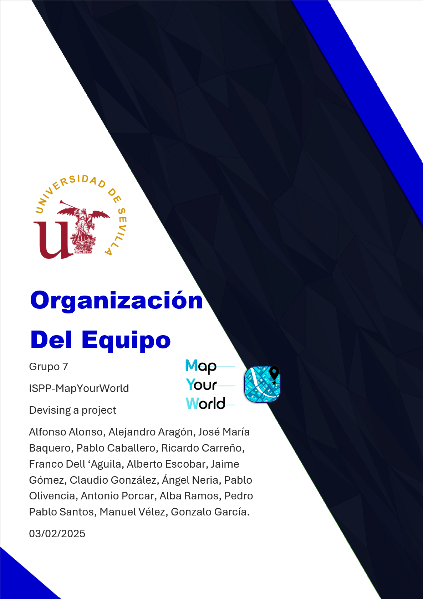

**CONTROL DE VERSIONES**

| VERSIÓN | FECHA    | COMENTARIOS              | AUTOR              |
|---------|----------|--------------------------|--------------------|
| v1      | 03/02/2025 | Primera versión          | Pablo Caballero, Alfonso Alonso |
| v1.1    | 04/02/2025 | Revisión del formato     | Ricardo Carreño    |
| v1.2    | 05/02/2025 | Actualización de contenido | Alfonso Alonso, Pablo Caballero |
| v1.2.1  | 05/02/2025 | Revisión del formato     | Ricardo Carreño    |
| v1.2.2  | 09/02/2025 | Cambiar equipos por roles | Alberto Escobar    |
| v1.2.3  | 19/02/2025 | Revisión del documento   | Antonio Porcar, Pablo Olivencia, Ricardo Carreño |

<!-- omit in toc--># Índice

- [1. Introducción](#1-introducción)
- [2. Asignación de roles](#2-asignación-de-roles)
  - [2.1. Leyenda](#21-leyenda)
  - [2.2. Matriz de Asignación de Roles](#22-matriz-de-asignación-de-roles)
- [3. Aptitudes del equipo](#3-aptitudes-del-equipo)
- [4. Rotación en las funciones de los miembros](#4-rotación-en-las-funciones-de-los-miembros)
- [5. Backend](#5-backend)
- [6. Frontend](#6-frontend)
- [7. Testing](#7-testing)
- [8. DevOps](#8-devops)
- [9. Seguridad](#9-seguridad)
- [10. Asesoría Legal](#10-asesoría-legal)
- [11. Marketing/Presentaciones/UI/UX](#11-marketingpresentacionesuiux)
- [12. Coordinación](#12-coordinación)
- [13. Referencias](#13-referencias)

# 1. Introducción

En este documento se describe la organización de los miembros del equipo, los roles que se ha decidido crear y quienes los conforman. Todos los miembros están asignados a los roles de *backend* o *frontend* puesto que todos deben desarrollar código, adicionalmente pertenecen a uno o más roles a los que han sido asignados de manera  voluntaria y basada en sus aptitudes.

Las personas que tienen una ***C*** a su derecha son los coordinadores del rol, se ha designado 2 coordinadores por rol para en caso de que una persona no se encuentre disponible, la otra pueda asistir a las reuniones.

Los coordinadores de cada rol se encargarán de garantizar el buen desempeño de las tareas dentro del rol y asistirán a las reuniones de coordinación del proyecto en la que compartirán el estado, solicitarán más recursos, etc.

# 2. Asignación de roles

## 2.1. Leyenda

- 🔵 Casilla azul: miembro asignado al rol

- ✅ Casilla azul con "***C***": Coordinador del rol  

## 2.2. Matriz de Asignación de Roles

| Nombre               | Backend | Frontend | Testing | DevOps | Seguridad | Legal | Marketing | Coordinación |
|----------------------|---------|----------|---------|--------|-----------|-------|-----------|--------------|
| Alfonso Alonso       | 🔵      |          |         |        |           |       |           | ✅           |
| Alejandro Aragón     | 🔵      |          | 🔵      |        | ✅        |       |           | 🔵           |
| José María Baquero   |         | 🔵       |         |        |           |       | 🔵        |              |
| Pablo Caballero      | 🔵      |          |         | ✅     |           |       |           | 🔵           |
| Ricardo Carreño      |         | 🔵       |         |        | 🔵        |       | ✅        | 🔵           |
| Franco Dell 'Aguila  |         | 🔵       |         | 🔵     |           |       | 🔵        |              |
| Alberto Escobar      | 🔵      |          |         |        |           |       |           |              |
| Jaime Gómez          |         | 🔵       |         |        |           |       | 🔵        |              |
| Claudio González     | 🔵      |          |         |        | 🔵        |       |           |              |
| Ángel Neria          |         | ✅       |         |        |           |       | 🔵        | 🔵           |
| Pablo Olivencia      | 🔵      | 🔵       |         |        |           |       |           |              |
| Antonio Porcar       | 🔵      |          | ✅      |        |           |       |           | 🔵           |
| Alba Ramos           |         | 🔵       |         |        |           | ✅    |           | 🔵           |
| Pedro Pablo Santos   | ✅      |          | 🔵      |        |           |       |           | 🔵           |
| Manuel Vélez         | 🔵      |          | 🔵      | 🔵     |           |       |           |              |
| Gonzalo García       | 🔵      | 🔵       | 🔵      | 🔵     | 🔵        |       |           |              |

# 3. Aptitudes del equipo

Se pidió a los miembros del equipo que describieran en un documento sus aptitudes y en qué área del proyecto tenían más interés en participar, estos documentos se encuentran en la carpeta *"Competencias personales"*.

# 4. Rotación en las funciones de los miembros

A lo largo de la duración del proyecto los miembros podrán cambiar de rol si así lo desean o si se requiere balancear cargas de trabajo, siempre se tendrán en cuenta las aptitudes y motivaciones de los miembros.

# 5. Backend

Los miembros asignados a este rol se encargarán de realizar el diseño, e implementación de todos los componentes del *backend* del sistema. Las personas que han sido asignadas a este rol tienen conocimiento en tecnologías de backend y bases de datos (node, MariaDB, Postgre, Django), además entre sus aptitudes destacan la capacidad de análisis los conocimientos técnicos avanzados y disfruten los desafíos técnicos.

Formado por:

- Alfonso Luis Alonso
- Gonzalo García
- Pablo Caballero
- Alberto Escobar - **C**
- Claudio González
- Pablo Olivencia
- Antonio Porcar
- Pedro Pablo Santos - **C**
- Manuel Vélez

# 6. Frontend

Los miembros de este rol están encargados de desarrollar el *frontend*, diseñar la interfaz de usuario, la experiencia de usuario (UX), etc. Las personas que han sido asignadas a este rol tienen interés por mejorar la experiencia del usuario, son creativas y tienen conocimiento en tecnologías de frontend (React, Tailwind, etc.)

Formado por:

- José María Baquero
- Ricardo Carreño
- Franco Dell Águila - **C**
- Jaime Gómez
- Ángel Neria - **C**
- Pablo Olivencia
- Alba Ramos
- Gonzalo García

# 7. Testing

Rol encargado de realizar las pruebas (*testing*), garantizar la calidad del software, detectar errores y asegurar el buen funcionamiento del sistema. Este rol está compuesto por personas que tienen experiencia en testing, habilidad para el análisis de código.

Formado por:

- Alejandro Aragón
- Gonzalo García
- Pedro Pablo
- Antonio Porcar - **C**
- Manuel Vélez - **C**

# 8. DevOps

Rol encargado de la integración continua, la automatización de despliegues, el monitoreo y la gestión de la  infraestructura. En este rol encontramos personas que disfrutan de la automatización de procesos, tienen experiencia con diferentes herramientas de testing y disfrutan revisando código y encontrando errores.

Formado por:

- Pablo Caballero - **C**
- Franco Dell Águila
- Manuel Vélez
- Gonzalo García

# 9. Seguridad

Rol encargado de proteger la infraestructura, asegurar la privacidad de los datos, prevenir ataques cibernéticos y garantizar el cumplimiento de las normativas de seguridad. Los miembros que tienen este rol tienen especial interés por mantener la seguridad de sistemas informáticos, mediante técnicas como la encriptación y la ofuscación. Son personas que también cursan otras asignaturas sobre seguridad.

Formado por:

- Alejandro Aragón - **C**
- Ricardo Carreño
- Claudio González
- Gonzalo García

# 10. Asesoría Legal

Rol encargado de asegurar el cumplimiento de las normativas vigentes que pudieran afectar al proyecto. Este rol está compuesto por personas que tienen interés por la legislación que atañe al desarrollo del software.

Formado por:

- Alba Ramos - **C**

# 11. Marketing/Presentaciones/UI/UX

Rol encargado de la estrategia de marketing, la creación de presentaciones visuales, el diseño de interfaces de usuario (UI), la experiencia de usuario (UX) y, principalmente, del buen diseño y formato de la documentación. Se enfocan en crear una experiencia atractiva y coherente para los usuarios, así como garantizar que la documentación sea clara, bien estructurada y visualmente atractiva. Los miembros del equipo que tienen este rol son personas creativas, con interés en el diseño de interfaces y mejora de experiencia de usuario, tienen experiencia con herramientas de diseño como Photoshop o Canva.

Formado por:

- Ricardo Carreño - **C**
- Franco Dell Águila
- Jaime Gómez
- José María Baquero
- Ángel Neria

# 12. Coordinación

Rol encargado de la gestión global del proyecto, compuesto por el coordinador principal y los coordinadores de cada uno de los roles anteriores. Su función es asegurar la correcta comunicación entre los roles, resolver los problemas que pudieran surgir entre los miembros del grupo, tomar decisiones estratégicas y velar por el cumplimiento de los objetivos generales del proyecto. Los miembros con este rol tienen especial interés por la gestión aplicando las metodologías y haciendo el seguimiento del proyecto aplicando las medidas correctivas necesarias. Utilizan Microsoft Proyect, GitHub Proyect, etc.

Para una mayor agilidad en la coordinación del proyecto, en caso de necesitarse una reunión solo se requerirá la asistencia de las personas necesarias para su celebración.

Formado por:

- **Aprobar documentación** - Alba Ramos
- **Coordinador** - Alfonso Luis Alonso
- **Vocalista** - Claudio González
- **Backend** -
  - Pedro Pablo
  - Alberto Escobar
- **Frontend** -
  - Ángel Neria
  - Franco Dell Águila
- **Testing** -
  - Antonio Porcar
  - Manuel Vélez
- **DevOps** - Pablo Caballero
- **Seguridad** - Alejandro Aragón
- **Legal** - Alba Ramos
- **Marketing** - Ricardo Carreño

# 13. Referencias

- [Carpeta de Competencias Personales](https://uses0.sharepoint.com/:f:/s/Grupo7ISPP/EsA4jsi6zOZMtEEfPGfonCkBFtl83bIYjfsZe77ws7RUgg?e=IPGJSn)
