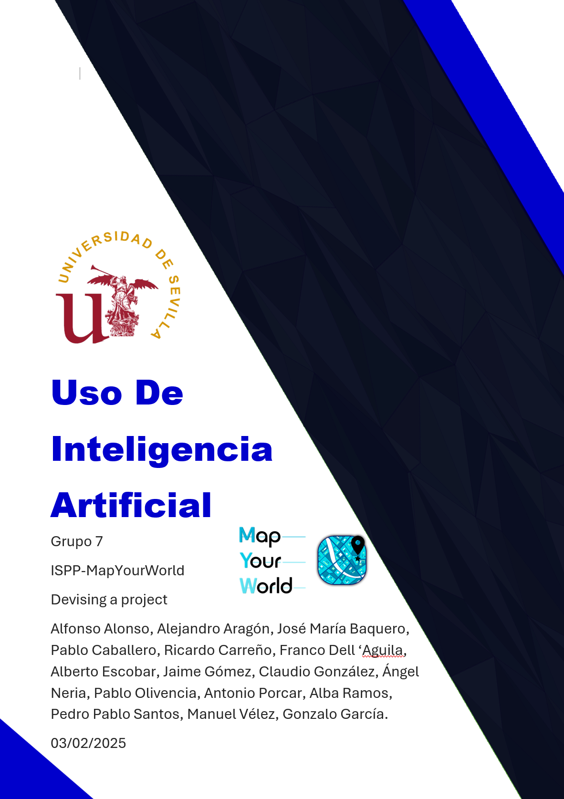

## Uso de Inteligencia Artificial

---

### CONTROL DE VERSIONES

| **VERSIÓN** | **FECHA**    | **COMENTARIOS**                          | **AUTOR**                                               |
|-------------|--------------|------------------------------------------|---------------------------------------------------------|
| v1          | 03/02/2025   | Primera versión                          | Antonio Porcar                                          |
| v1.1        | 04/02/2025   | Revisión del formato                     | Ricardo Carrero                                         |
| v1.1.1      | 05/02/2025   | Cambios menores del formato              | Ricardo Carrero                                         |
| V1.1.2      | 11/02/2025   | Añadida sección registro uso IA          | Pablo Caballero                                         |
| V1.1.3      | 12/02/2025   | Añadida sección registro uso IA          | Jaime Gómez y José María Baquero                        |
| V1.1.4      | 13/02/2025   | Añadida sección registro uso IA          | Claudio González Benito                                 |
| v1.1.5      | 13/02/2025   | Añadida sección registro uso IA          | Ricardo Carrero                                         |
| v1.2        | 13/02/2025   | Arreglos menores; sección de referencias   | Ricardo Carrero                                         |
| V1.2.1      | 14/02/2025   | Añadida sección registro uso IA          | Pablo Olivencia                                         |
| v1.2.2      | 19/02/2025   | Revisión del formato                     | Ricardo Carrero                                         |

---

# Índice

- [1. Introducción](#introducción)
- [2. ¿Para qué y cómo vamos a usar la IA?](#para-qu%C3%A9-y-c%C3%B3mo-vamos-a-usar-la-ia)
- [3. Registro de uso de IA](#registro-de-uso-de-ia)
- [4. Referencias](#referencias)

# Introducción

En el siguiente documento se presenta de manera detallada y estructurada el uso que se dará a las herramientas de **Inteligencia Artificial** en el Grupo 7 de la asignatura *Ingeniería del Software y Práctica Profesional*.

Se implementarán soluciones apoyándose en estas herramientas para redactar textos más claros y concisos, así como para mejorar el software desarrollado, obteniendo uno más robusto y con mayor rendimiento siempre que sea posible.

# ¿Para qué y cómo vamos a usar la IA?

Las herramientas de **Inteligencia Artificial** permitirán ajustar tanto el estilo como la estructura de los documentos a presentar, de modo que el contenido mantenga la coherencia y precisión de la información. Esto permitirá ahorrar tiempo en revisiones manuales y garantizar un cierto grado de calidad en los informes generados.

En cuanto al desarrollo de código, se aplicarán estas herramientas en las fases de depuración y mejora continua. Una vez desarrollado el código de la funcionalidad encomendada, el miembro del equipo podrá apoyarse en ellas para analizar la sintaxis y lógica del código generado, detectando inconsistencias, vulnerabilidades o ineficiencias.

# Registro de uso de IA

- **Pablo Caballero María, 06/02/2024:** Usé la herramienta *removebg* para eliminar el fondo de mi firma en el documento "*Commitment Agreement*". Dicha herramienta utiliza IA para detectar automáticamente el fondo de la imagen.
- **Jaime Gómez Marín y José María Baquero Rodríguez, 11/02/2024:** Usamos la herramienta *ChatGPT* para consultar aplicaciones similares a MapYourWorld, con el fin de identificar competidores.
- **Franco Dell Águila Ureña, 12/02/2024:** Usé la herramienta *ChatGPT* para obtener ideas sobre distintos logos posibles y una paleta de colores adecuada.
- **Claudio González Benito, 13/02/2025:** Usé *ChatGPT* para esquematizar mejor la información de una de las proto-personas creadas previamente, de manera que se distribuya adecuadamente en 3 diapositivas.
- **Ricardo Carrero Mario, 13/02/2025:** Usé *ChatGPT* para obtener versiones formales de términos y oraciones para la correcta realización de documentos y para la presentación de la semana 2.
- **Pablo Olivencia Moreno, 14/02/2025:** Usé *ChatGPT* para el formateo y correcta presentación de los **Usuarios Piloto** en el documento de diseño.
- **Manuel Vélez López, 14/02/2025:** Usé *ChatGPT* para encontrar información sobre algunos competidores de MapYourWorld.
- **Jaime Gómez Marín, 17/02/2025:** Usé *lovable* para generar una plantilla para la landing page.
- **Manuel Vélez López, 01/03/2025:** Usé *ChatGPT* para dividir los distritos en partes más pequeñas.
- **Jaime Gómez Marín, 12/03/2025:** Useé *ChatGPT* para crear una plantilla para revision.md

# Referencias

- Herramienta [removebg](https://www.remove.bg/es)
- Herramienta [ChatGPT](https://chatgpt.com/)
- Documento [Commitment Agreement](https://uses0.sharepoint.com/:w:/s/Grupo7ISPP/EUFGat98vcJCnMvGZ59XVxMBkPwpRwgfIKd-jkLpSDAshg?e=qFeslr)
