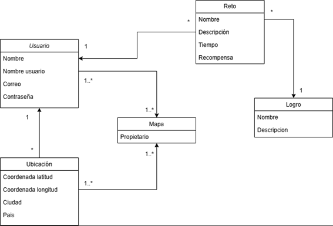

  
  

<h1 align="center">Application Lifecycle Management</h1>

    Grupo 7

    ISPP-MapYourWorld

    Sprint 1

    Ángel Neria, Pedro Pablo Santos, Pablo Caballero, Pablo Olivencia y Ricardo Carrero

    12/03/2025

---

# Índice

- [1. Introducción](#introducción)
- [2. Estrategia y Metodología](#estrategia-y-metodología)
  - [2.1. Metodología de desarrollo](#metodología-de-desarrollo)
  - [2.2. Enfoque del ciclo de vida: Descripción de las fases](#enfoque-del-ciclo-de-vida-descripción-de-las-fases)
- [3. Diseño y Arquitectura](#diseño-y-arquitectura)
  - [3.1. Diseño de la solución](#diseño-de-la-solución)
  - [3.2. Decisiones de arquitectura](#decisiones-de-arquitectura)
- [4. Desarrollo y Control de Versiones](#desarrollo-y-control-de-versiones)
- [5. Integración Continua y Despliegue Continuo (CI/CD)](#integración-continua-y-despliegue-continuo-cicd)
  - [5.1. Estrategia de automatización: Herramientas y procesos para la integración y despliegue](#estrategia-de-automatización-herramientas-y-procesos-para-la-integración-y-despliegue)
  - [5.2. Pipeline de despliegue: Descripción de las etapas de construcción, pruebas y despliegue](#pipeline-de-despliegue-descripción-de-las-etapas-de-construcción-pruebas-y-despliegue)
- [6. Implementación y Mantenimiento](#implementación-y-mantenimiento)
- [7. Herramientas utilizadas](#herramientas-utilizadas)
  - [7.1. Git](#git)
  - [7.2. GitHub](#github)
  - [7.3. GitHub Projects](#github-projects)
  - [7.4. GitHub Actions](#github-actions)
  - [7.5. Clockify](#clockify)
  - [7.6. SonarCloud](#sonarcloud)
  - [7.7. Postman](#postman)
  - [7.8. Microsoft Teams](#microsoft-teams)

---

# Introducción

Definir la estrategia de ALM para MapYourWorld, abarcando desde la planificación hasta el mantenimiento, para asegurar un desarrollo estructurado, eficiente y adaptable.

Este documento abarca todas las fases del ciclo de vida de la aplicación, integrando el diseño de la arquitectura, el desarrollo e implementación del software con un riguroso control de versiones, la ejecución de pruebas integrales para garantizar su funcionamiento y seguridad, el despliegue en entornos productivos de manera controlada y, finalmente, la actualización continua mediante la gestión de incidencias y la incorporación de mejoras.

---

# Estrategia y Metodología

## Metodología de desarrollo

La metodología de desarrollo del proyecto es **Scrum**. Scrum es una metodología ágil y, además, un conjunto de directrices acerca de cómo estructurar el tiempo. Se caracteriza por un espíritu de flexibilidad y adaptación al cambio. Esta filosofía es especialmente importante en esta asignatura, dado que el equipo de trabajo es muy grande y las tareas son muy transversales, abarcando todas las fases de un proyecto y todas las áreas (frontend, backend, documentación, marketing, etc.). Además, el hecho de recibir una gran cantidad de feedback cada semana, similar al que proporcionaría un cliente, hace especialmente adecuada la adopción de Scrum, ya que es vital saber reaccionar al cambio y ser ágiles.

Durante el desarrollo se realizarán 3 sprints. Cada sprint será precedido por una reunión para planificar a alto nivel las tareas a realizar. Además, cada sprint tendrá asociado un *sprint backlog*, que será un subconjunto de tareas del *product backlog*. Asimismo, el jefe de coordinadores supervisará estos documentos. Al finalizar cada sprint, se llevará a cabo una reunión de retrospectiva para analizar el desempeño del equipo e identificar áreas clave de mejora continua para las semanas siguientes. Durante el primer sprint se desarrollarán las "funcionalidades core" de la aplicación, es decir, aquellas características más representativas que nos diferencien de nuestros competidores. En los 2 sprints siguientes, se trabajará en desarrollar el producto más allá de este primer esqueleto, iterando para refinar la aplicación y alcanzar una alta calidad. Paralelamente, se realizarán tareas legales, de documentación y marketing.

Con mayor detalle, cada sprint incluirá subfases dedicadas a la planificación, desarrollo, pruebas y despliegue de lo que se esté implementando en ese momento.

---

## Enfoque del ciclo de vida: Descripción de las fases

Dentro de cada sprint existen las siguientes fases: **planificación**, **desarrollo**, **pruebas**, **despliegue** y **mantenimiento**. Esta elección es un estándar de la industria en la ejecución de proyectos ingenieriles, aunque puede variar ligeramente para adaptarse a las características de cada proyecto.

- **Planificación:** Los miembros involucrados se reunirán para tomar decisiones que afecten a cada tarea, definiendo y repartiendo las subtareas y organizando los tiempos para su adecuado desarrollo, ya que cada equipo es autogestionado.
- **Desarrollo:** Se realizarán las tareas de programación o redacción de la documentación pertinente. Al final del proyecto, todos los miembros habrán participado en diversas tareas de ambos tipos. En esta fase, se utilizará el stack tecnológico definido para construir progresivamente las funcionalidades de la aplicación, lo que podría incluir la formación de algún miembro en algún aspecto técnico.
- **Pruebas:** Se ejecutarán pruebas de integración y de sistema. Cada miembro realizará pruebas unitarias sobre su propio código durante la fase de desarrollo, mientras que el equipo de testing se encargará de pruebas sobre componentes más amplios y sobre la aplicación completa, reportando cualquier error.
- **Despliegue:** El equipo de DevOps actualizará el despliegue en nuestro servidor local (Raspberry Pi), comprobando que la aplicación sea accesible y funcional desde un cliente externo.
- **Mantenimiento:** Se implementarán acciones para mantener y actualizar la aplicación tras su despliegue, garantizando la corrección de errores y la mejora continua.

---

# Diseño y Arquitectura

## Diseño de la solución

Se presenta el diagrama de clases, en el que se han tomado las siguientes decisiones:

- Las entidades de **mapa-usuario** y **mapa-ubicación** tienen relaciones de muchos a muchos, lo que puede generar dificultades adicionales, ya que este tipo de relaciones puede presentar problemas en su implementación.
- Posteriormente, se establece una relación de muchos a uno que será mucho más sencilla, ya que la clave ajena implica que cada objeto del "muchos" esté asociado a un único objeto del "uno" (por ejemplo, muchas ubicaciones serán registradas por un usuario).

## Decisiones de arquitectura

La arquitectura de MapYourWorld se fundamenta en el enfoque de **microservicios**, lo que permite desarrollar, desplegar y escalar cada componente del sistema de forma independiente. Esta metodología aporta flexibilidad, facilita el mantenimiento y permite incorporar nuevas funcionalidades sin afectar el funcionamiento global de la aplicación.

Para el backend se ha elegido **Node.js** junto con el framework **Express**. Node.js ofrece un entorno asíncrono y no bloqueante, ideal para manejar un alto volumen de peticiones concurrentes, mientras que Express simplifica la creación de APIs REST y la integración de diversas herramientas, permitiendo iteraciones rápidas.

La comunicación entre microservicios se gestiona a través de **Apache Kafka**, una tecnología de mensajería distribuida que permite el procesamiento en tiempo real de grandes volúmenes de datos con baja latencia, garantizando una integración escalable y robusta.

En el frontend se opta por **React Native** para desarrollar aplicaciones móviles nativas en Android e iOS a partir de una única base de código, optimizando tiempos de desarrollo y mantenimiento. Además, la incorporación de **Tailwind CSS** facilita la creación de interfaces modernas y coherentes de forma ágil.

Para el almacenamiento de datos se ha seleccionado **PostgreSQL**, complementado con la extensión **PostGIS**, que posibilita consultas geoespaciales avanzadas, lo cual es especialmente relevante en una aplicación que utiliza la geolocalización para ofrecer experiencias interactivas a los usuarios.

El despliegue se realizará inicialmente en plataformas **Raspberry Pi**, proporcionando un entorno de bajo costo y consumo energético para pruebas locales, lo que permitirá validar el rendimiento y la estabilidad antes de escalar a una infraestructura más robusta en producción.

Finalmente, se implementarán estrategias de pruebas y validación utilizando herramientas como **Jest**, **React Testing Library** y **Postman**, garantizando la calidad, estabilidad y seguridad del sistema en cada fase.

Esta combinación de tecnologías y patrones ha sido cuidadosamente seleccionada para responder óptimamente a los requerimientos del negocio, asegurando un desarrollo ágil, escalable y adaptable a las demandas del mercado.

---

# Desarrollo y Control de Versiones

El entorno de desarrollo estará centrado en **Node.js** para el backend, utilizando **Express** como framework para construir APIs REST. En el frontend, se empleará **React Native** para crear aplicaciones móviles nativas para Android e iOS con una única base de código, junto con **Tailwind CSS** para una estilización rápida y eficiente.

**Git** es la herramienta estándar de control de versiones distribuido que se utilizará, ya que permite a cada miembro trabajar en su propia copia del código y fusionarlas sin conflictos. **GitHub** será la plataforma elegida para alojar el repositorio.

En cuanto a la **estrategia de ramas**, se utilizará un flujo de trabajo basado en ramas. Cada nueva funcionalidad se desarrollará en su propia rama separada. La rama principal, llamada **main**, contendrá siempre el código estable y listo para producción.

Cuando un desarrollador comience a trabajar en una nueva funcionalidad, se crea una rama a partir de **develop** siguiendo el patrón `feature/nombre-característica`. Por ejemplo, si se va a trabajar en un sistema de login, la rama podría llamarse `feature/login-sistema`.

Una vez que la funcionalidad esté lista y probada localmente, se realizará un **pull request** o fusión de la rama de la característica a **develop**. Este proceso permite integrar el código de manera controlada y segura en el proyecto principal; posteriormente, al desplegar, se fusionará en **main**.

*Después de fusionar la rama de la característica, esta se elimina, ya que su propósito se ha cumplido. Esto mantiene el repositorio limpio y organizado.*

---

# Integración Continua y Despliegue Continuo (CI/CD)

## Estrategia de automatización: Herramientas y procesos para la integración y despliegue

La estrategia de automatización para la integración y despliegue consiste en que, según nuestra política de control de versiones, el repositorio público en GitHub contendrá en todo momento una versión atómica y funcional del proyecto sobre la que se irán integrando los incrementos sucesivos.

En cuanto al despliegue, además del hardware (Raspberry Pi), existirá un software específico en el entorno de despliegue que atenderá la aplicación en producción: un balanceador de carga, archivos con las variables de entorno necesarias y todas las dependencias de Node.js requeridas para su funcionamiento.

## Pipeline de despliegue: Descripción de las etapas de construcción, pruebas y despliegue

Con cada commit al repositorio se desencadenará un conjunto de workflows automáticamente para verificar la integridad y validez del commit. Esto incluirá workflows pre-commit para validar el estilo del código fuente y el mensaje de commit.

Posteriormente, se realizará un análisis estático del código mediante **SonarCloud**, junto con workflows de testing y despliegue, para asegurar que todas las funcionalidades sigan operando correctamente tras cada incremento.

---

# Implementación y Mantenimiento

El proceso de despliegue se realizará al final de cada sprint, permitiendo liberar de forma continua las funcionalidades completadas. Cada vez que se termine una funcionalidad, primero se desplegará en un **entorno de pruebas o staging**, donde se validará que cumpla con los requerimientos establecidos y se ejecutarán las pruebas automatizadas y manuales necesarias. Esto garantiza que el código esté listo para integrarse en producción sin introducir errores.

Una vez superadas las pruebas en staging, se procederá con un **despliegue progresivo a producción**. Esto significa que la nueva funcionalidad se liberará de manera gradual, inicialmente a un pequeño grupo de usuarios o servidores, antes de desplegarse a toda la base de usuarios. Este enfoque minimiza riesgos al permitir la detección temprana de problemas.

Después del despliegue a producción, se implementará un monitoreo constante para detectar problemas de rendimiento, errores o caídas en el sistema. Se utilizarán herramientas de monitoreo y registro de logs para identificar rápidamente cualquier incidencia, y el equipo de desarrollo o soporte realizará las correcciones necesarias.

El mantenimiento post-lanzamiento será crucial para garantizar la estabilidad y la mejora continua de la aplicación. Se establecerá un equipo de **soporte continuo** encargado de resolver incidencias críticas en producción, monitorizar el sistema, gestionar alertas y solucionar problemas de forma rápida y eficiente.

Además, el sistema se actualizará **regularmente** después de cada sprint con nuevas funcionalidades, mejoras en el rendimiento, corrección de errores y actualizaciones de seguridad. Estas actualizaciones se desplegarán en entornos de prueba antes de pasar a producción, siguiendo el mismo flujo de trabajo para garantizar que cada cambio no afecte negativamente al sistema.

El proceso de **mejora continua** también será prioritario, incluyendo la recolección de **feedback de usuarios**, análisis de métricas de uso y monitoreo del rendimiento para identificar áreas de mejora.

---

# Herramientas utilizadas

## Git

**Uso:** Git es un sistema de control de versiones que permite gestionar y rastrear los cambios en el código fuente. Se utilizará para trabajar colaborativamente, crear ramas para nuevas funcionalidades sin afectar el código principal y mantener un historial de cambios para poder revertir a versiones anteriores si es necesario.

## GitHub

**Uso:** Plataforma de alojamiento de repositorios Git. Se utilizará para gestionar el código fuente del proyecto, facilitar la colaboración entre desarrolladores y llevar un control de versiones eficiente. A través de GitHub, los desarrolladores podrán realizar pull requests, revisar código y mantener un historial claro de los cambios.

## GitHub Projects

**Uso:** Herramienta de gestión de proyectos integrada en GitHub. Se utilizará para organizar las tareas del equipo, establecer prioridades y hacer un seguimiento del avance del proyecto. Facilita la visualización del progreso mediante tableros Kanban con estados como "Por hacer", "En progreso" y "Completado".

## GitHub Actions

**Uso:** Herramienta para automatizar flujos de trabajo dentro de GitHub. Se empleará para configurar pipelines de integración continua (CI) y despliegue continuo (CD), incluyendo la ejecución automática de pruebas, despliegue en entornos de staging y producción, y la generación de versiones del código al hacer push a las ramas.

## Clockify

**Uso:** Herramienta para el seguimiento y gestión del tiempo. Los miembros del equipo la utilizarán para registrar el tiempo invertido en tareas específicas, permitiendo medir la productividad, hacer seguimiento del progreso y ajustar estimaciones para futuras tareas.

## SonarCloud

**Uso:** Plataforma de análisis estático de código que proporciona informes sobre la calidad del código, cobertura de pruebas y posibles vulnerabilidades. Se utilizará para asegurar que el código cumpla con los estándares de calidad, identificar errores y mejorar la seguridad y mantenibilidad del software.

## Postman

**Uso:** Herramienta para pruebas de APIs. Postman es excelente para probar y depurar peticiones HTTP, asegurando que las funcionalidades del backend estén correctamente implementadas.

## Microsoft Teams

**Uso:** Herramienta de comunicación y colaboración en equipo. Se utilizará para coordinar reuniones, facilitar la comunicación entre los miembros del equipo y compartir archivos y actualizaciones de forma rápida.
