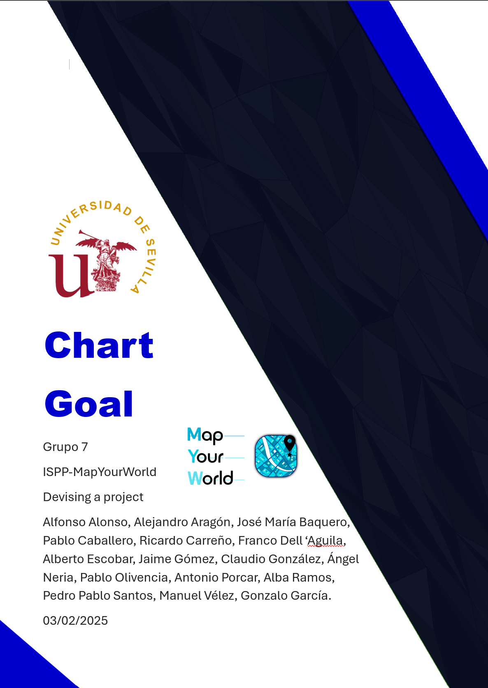

**CONTROL DE VERSIONES**

| VERSIÓN | FECHA     | COMENTARIOS              | AUTOR                                      |
|---------|----------|--------------------------|-------------------------------------------|
| V1.0    | 03/02/2025 | Primera versión         | Pablo Caballero|
| V1.1    | 09/02/2025 | Revisión                | Antonio Porcar, Pablo Olivencia y Ricardo Carreño  |

# Índice

1. [Introducción](#introducción)
2. [Lista de hitos](#lista-de-hitos)

# Introducción

En el siguiente documento se presenta de forma concisa y gráfica una lista de hitos principales a alcanzar durante el desarrollo del presente proyecto. Este Chart Goal no solo facilita la planificación y el seguimiento del progreso, sino que también sirve como una fuente de información centralizada para todos los miembros del equipo. Gracias a esta herramienta, cada integrante podrá identificar en qué fase del proyecto debería encontrarse en un momento determinado y reconocer posibles desviaciones respecto al plan inicial, permitiendo así la activación de estrategias correctivas de manera oportuna.

Además, este gráfico representa un elemento clave en la comunicación y coordinación interna, ya que, a lo largo de cada fase, distintos equipos deberán colaborar estrechamente para abordar una misma tarea desde diferentes perspectivas. La visualización clara de los hitos y dependencias fomentará una mayor alineación entre los equipos, optimizando los recursos disponibles y asegurando que el desarrollo avance de manera eficiente y estructurada.

# Lista de hitos

### **Semana 1:**

- Idea de negocio
- MVP
- Organización del equipo
- Informe del uso de IA
- Gestión del conocimiento
- Commitment Agreement

### **Semanas 2-4:**

- MVP y casos de uso core
- Plan de negocio y usuarios piloto
- Mock-ups de producto
- Metodología de trabajo y herramientas
- Plan de trabajo de 3 sprints
- Commitment de usuarios pilotos reales

### **Semanas 5-6 (Sprint 1):**

- Prototipo funcional de los casos de uso core del MVP
- GitHub y GitHub Project
- Despliegue en App Engine
- Plan de los usuarios piloto

### **Semanas 7-8 (Sprint 2):**

- Prototipo funcional completo del MVP (core, admin, registro y pago)
- GitHub y GitHub Project
- Despliegue en App Engine
- Feedback de los usuarios piloto

### **Semanas 9-10 (Sprint 3):**

- Versión final del prototipo
- GitHub y GitHub Project
- Despliegue en App Engine
- Testing
- Tareas de marketing

### **Semanas 11-12:**

- Nueva versión del prototipo
- GitHub y GitHub Project
- Despliegue en App Engine
- Campaña de publicidad
- Plan de lanzamiento en evento público
- Competidores
- Análisis DAFO
- Planes técnicos y de finanzas
- Plan de ROI

### **Semana 13:**

- Revisión del trabajo individual

### **Semana 14:**

- Versión final del prototipo
- GitHub y GitHub Project
- Despliegue en App Engine
- Evento público