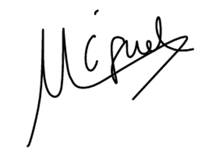

<p align="center">
  
  
</p>

<h1 align="center">Commitment Agreement para Usuarios Piloto</h1>

<p align="center">
    Grupo 7
</p>
<p align="center">
    ISPP-MapYourWorld
</p>
<p align="center">
    Sprint 1
</p>
<p align="center">
    Claudio Gonzalez Benito
</p>
<p align="center">
    13/03/2025
</p>

**CONTROL DE VERSIONES**

| VERSIÓN | FECHA     | COMENTARIOS              | AUTOR              |
|---------|-----------|--------------------------|--------------------|
| V1      | 13/03/2025| Primera versión          | Claudio Gonzalez Benito |
| V2      | 13/03/2025| Especificando calculo de nota total         | Claudio Gonzalez Benito |

<!-- omit in toc--> 
# Índice

- [1. Contenido](#1-contenido)
  - [1.1. Compromiso del Usuario Piloto](#11-compromiso-del-usuario-piloto)
  - [1.2. Evaluación](#12-evaluacion)
  - [1.3. Compromiso del Grupo 7](#13-compromiso-del-grupo-7)
  - [1.4. Firmas](#14-firmas)

# 1. Contenido

## 1.1. Compromiso del Usuario Piloto

**Compromiso de Participación como Usuario Piloto en la Asignatura ISPP (Ingeniería del Software y Práctica Profesional) - Curso 2024-25**

**Fecha:** 13/03/2025

**Compromiso:** Yo, como usuario piloto de la aplicación desarrollada en el marco de la asignatura ISPP (Ingeniería del Software y Práctica Profesional), me comprometo a cumplir con los siguientes requisitos y condiciones:

- **Tiempo de Respuesta:** Me comprometo a responder las encuestas enviadas por correo en un plazo máximo de 6 días desde su recepción.
- **Tiempo de Prueba:** Me comprometo a dedicar entre 30 minutos y 1 hora (o el tiempo especificado en cada tarea) a probar la aplicación, asegurando así la calidad del feedback proporcionado.
- **Registro de Tiempo:** Llevaré un registro detallado del tiempo dedicado a cada sesión de prueba con el siguiente formato:
  
  ```
  dd/mm: [lista de cosas que probé], duración hh:mm
  ```
  
  Este registro deberá ser proporcionado en el formulario correspondiente. Esta cláusula no se aplica a la primera fecha prevista.
- **Pruebas en Entorno Real:** Si la aplicación requiere el uso de funciones de geolocalización que impliquen desplazamiento, me comprometo a realizarlas según lo indicado en las pruebas.
- **Aceptación de la Rúbrica:** Si participo como usuario piloto dentro de la asignatura, acepto la rúbrica de evaluación y firmaré este commitment agreement.

Al firmar este documento, entiendo y acepto las responsabilidades que se me han asignado y me comprometo a cumplirlas según lo establecido en este documento.

## 1.2. Evaluación

La evaluación de los usuarios piloto se realizará según la siguiente rúbrica por cada encuesta exceptuando la primera, y la nota por cada sprint sera la nota de la encuesta de ese sprint, siendo la nota final la media de todas. La rubrica es:

**Puntuación total: 10 puntos**

- **Tiempo dedicado (3 puntos)**
- **Calidad de las respuestas (2 puntos)**
- **Seguir todas las instrucciones (3 puntos)**
- **Responder a tiempo las encuestas (2 puntos)**

**Penalizaciones:**

- **Tiempo dedicado:**
  - Si se cumple con el tiempo especificado: nota completa.
  - Si se dedica menos tiempo:
    - 1.5 puntos menos si se ha dedicado más de la mitad del tiempo especificado.
    - 3 puntos menos si se ha dedicado menos de la mitad del tiempo requerido.
  - Si no se sigue el formato de registro de tiempo: 1 punto menos.
- **Seguir instrucciones:** 1 punto menos por cada instrucción que no se cumpla.
- **Responder a tiempo:** 1 punto menos por cada día de retraso en responder.

**Excepción:**

Debido a que los criterios de evaluación no fueron acordados para el primer formulario y las respuestas fueron anónimas, la evaluación de los usuarios piloto en esa ocasión se basará únicamente en si han respondido a los correos en los que se solicitaba respuesta.

## 1.3. Compromiso del Grupo 7

Por parte del grupo 7, nos comprometemos a ser puntuales a la hora de enviar los correos, que se enviarán el día fijado a las 12:00 AM. También nos comprometemos, como usuarios del servicio que vamos a establecer, a mantener rigurosa confidencialidad con los datos derivados del uso de la aplicación, que se borrarán una vez finalizado el período de prueba y evaluación, para facilitar así el tratamiento de los datos. Además, nos comprometemos a evaluar de forma justa a los usuarios piloto según los criterios establecidos siguiendo la rúbrica.

## 1.4. Firmas

Yo, como Claudio Gonzalez Benito, representante del grupo y alumno de la asignatura ISPP (Ingeniería del Software y Práctica Profesional), me comprometo a cumplir con los requisitos y condiciones estipuladas en este documento
Firma:


Yo, como Ana Isabel, Niza Cobo, persona externa a la asignatura y usuario piloto de la aplicación desarrollada por el grupo 7 en el marco de la asignatura ISPP (Ingeniería del Software y Práctica Profesional), me comprometo a cumplir con los requisitos y condiciones estipuladas en este documento
Firma:


Yo, como Miguel Hernández Sánchez, alumno de ispp y usuario piloto de
la aplicación desarrollada por el grupo 7 en el marco de la asignatura
ISPP (Ingeniería del Software y Práctica Profesional), me comprometo a
cumplir con los requisitos y condiciones estipuladas en este
documento.





Yo, como Juan Antonio Moreno Moguel, alumno de ispp y usuario piloto de la aplicación desarrollada por el grupo 7 en el marco de la asignatura ISPP (Ingeniería del Software y Práctica Profesional), me comprometo a cumplir con los requisitos y condiciones estipuladas en este documento


