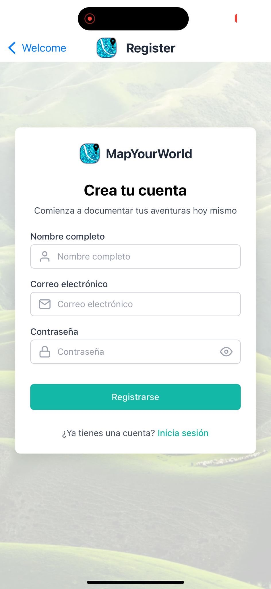
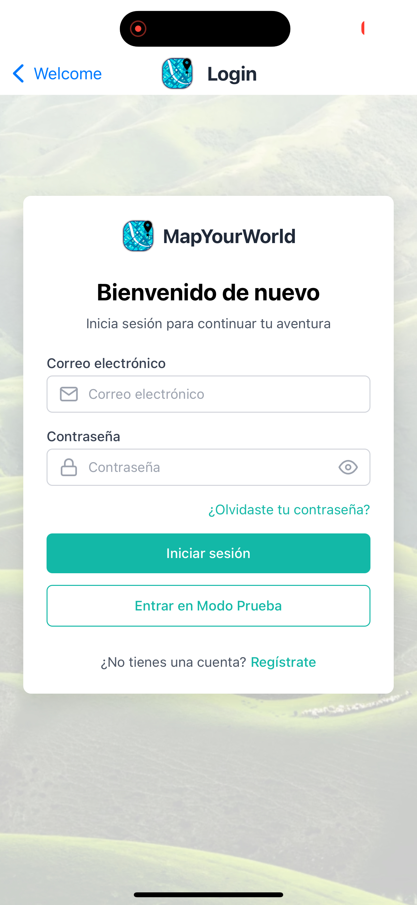
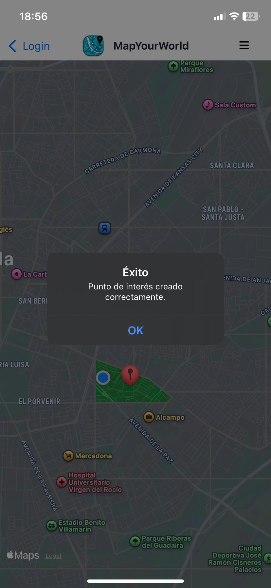
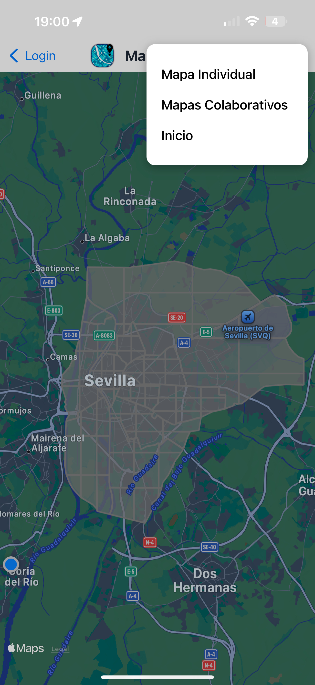
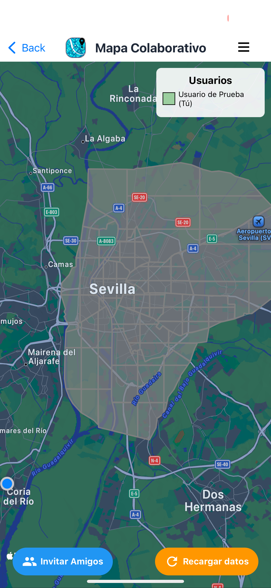

  
  

<h1 align="center">Guia de Revisión</h1>

    Grupo 7

    ISPP-MapYourWorld

    Sprint 1

    Jaime Gómez Marín, Ángel Neria Acal y José María Baquero Rodríguez

    12/03/2025

---
**CONTROL DE VERSIONES**

| VERSIÓN | FECHA     | COMENTARIOS              | AUTOR              |
|---------|-----------|--------------------------|--------------------|
| V1      | 12/03/2025| Primera versión          | Jaime Gómez Marín, Ángel Neria Acal y José María Baquero Rodríguez     |
| V2      | 13/03/2025| Actualización del documento| Ángel Neria Acal y José María Baquero Rodríguez

---
## 1. Mapeo Explícito de Casos de Uso (UC) a Interacciones

### 1.1. No Matchmaking

- **Registro**:  
  El usuario se registra en el sistema proporcionando su nombre, correo electrónico y contraseña a través de un formulario. La funcionalidad aún no está implementada.
  
  *(Mockup ficticio en #S1)*

  - **Login**:  
  El usuario inicia sesión en el sistema introduciendo el correo y contraseña con el que peviamente se ha debido registrar en el sistema. Se debe entrar en modo prueba porque no esta implementada la funcionalidad.
  
  *(Mockup ficticio en #S1)*

  - **Exploración de zonas no descubiertas**:  
  El usuario se desplaza físicamente hacia la zona que quiere descubrir. Al llegar a la ubicación, el sistema detecta su presencia y automáticamente desbloquea la localización en su mapa personal pintandola de color verde.
  
  *(Caso de uso implementado en #S1)*
  
  *(Caso de uso implementado en #S1)*

    - **Registro de puntos de interés**:  
  El usuario selecciona una zona del mapa desbloqueada en la que desea añadir un punto de interés. Al tocar la ubicación, se muestra una ventana emergente con un formulario donde debe añadir un nombre y una descripción, una etiqueta, que es opcional y fotografías, también opcionales. Una vez completado el proceso, el punto de interés queda registrado y aparece en el mapa interactivo con un marcador.
  
  *(Caso de uso implementado en #S1)*

  
  *(Caso de uso implementado en #S1)*

  
  *(Caso de uso implementado en #S1)*

### 1.2. Matchmaking

- **Participación en mapas colaborativos:**
  El usuario registrado puede acceder a la sección de mapas colaborativos desde el menú desplegable de la esquina superior derecha de su pantalla.
  
  *(Mockup ficticio en #S1)*
  
  Tras seleccionar la opción "Mapas Colaborativos", aparece una pantalla donde se listan los mapas colaborativos a los que pertenece el usuario, además de las opciones de invitar a usuarios, eliminar dicho mapa o crear un nuevo mapa.
  
  *(Mockup ficticio en #S1)*

  Si el usuario crea un nuevo mapa colaborativo pulsando sobre el boton "+" en la parte superior derecha, se muestra un formulario donde debe indicar el nombre del mapa, una descripción e indicar el número de usuarios máximos  que pueden formar parte de dicho mapa.
  
  *(Mockup ficticio en #S1)*

  Si el usuario pulsa sobre alguno de los mapas colaborativos que aparecen listados pasa a visualizar el progreso de dicho mapa, viendo en la parte superior derecha una leyenda que indica el color asociado a las zonas descuniertas por el resto de usuarios que formen parte del mapa colaborativo. También dispone de las funcionalidades de invitar a otros usuarios y recargar datos, las cuales estan disponibles en la parte inferior de la pantalla.
  
  *(Mockup ficticio en #S1)*

  Si desde dentro de un mapa colaborativo el usuario pulsa el boton de "Invitar Amigos" situado en la parte inferior de la pantalla, se muestra un formulario donde debe introducir el nombre del usuario que se quiere invitar a participar en dicho mapa.
  
  *(Mockup ficticio en #S1)*
  
  

---

## 2. Datos Necesarios para Realizar la Revisión

- **URL de la página de inicio (Landing Page):** [Landing Page de MapYourWorld](https://mapyourworld.netlify.app/)  
  

- **Credenciales de Usuarios:**
  Por ahora la funcionalidad implementada no precisa de credenciales de acceso para la aplicación, ya que el registro y login no se ha implementado como es debido. Para acceder se presenta la opción de *Entrar en modo prueba*, dentro de la pantalla de *Login*, lo que permite el acceso instantáneo usando un usuario de prueba. No obstante existen usuarios creados en la base de datos, aunque como se ha mencionado, actualmente no es posible acceder con sus credenciales.

  - **Usuario 1:**  
    - Usuario: `user1`  
    - Contraseña: `user12345`
  - **Usuario 2:**  
    - Usuario: `user2`  
    - Contraseña: `user12345`
  - **Administrador:**  
    - Usuario: `admin`  
    - Contraseña: `admin12345`

- **Plataforma de Despliegue:**
  - **URL:** [Inserta la URL aquí]  
  - **Credenciales:**  
    - Acceder como usuario de prueba.

- **Repositorio en GitHub:**  
  - **URL:** [Repositorio de MapYourWorld](https://github.com/ISPP-Grupo-7/MapYourWorld)

- **Herramienta de Seguimiento de Tiempo:**
  - **URL:** [Reporte de Clockify](https://app.clockify.me/shared/67d1d4ef61753b24b9d8d838)  
  

---

## 3. Requisitos Potenciales para Usar el Sistema

- Activar el acceso a la localización.
- Activar el acceso a la galería de imágenes si desea subir alguna foto asociada a algún punto de interés.

---

## 4. Demo de la Evaluación

- **Enlace a la demo:**  
  [Inserta el enlace al archivo mp4 de la demo almacenado en GitHub]
