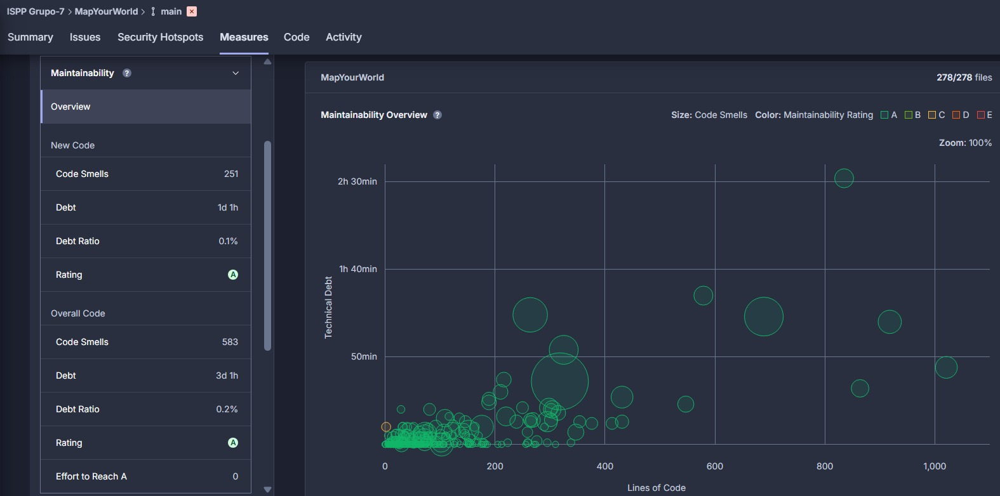
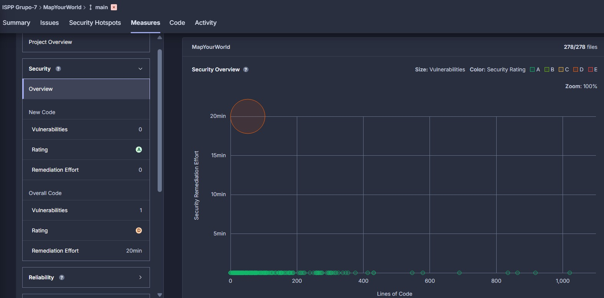
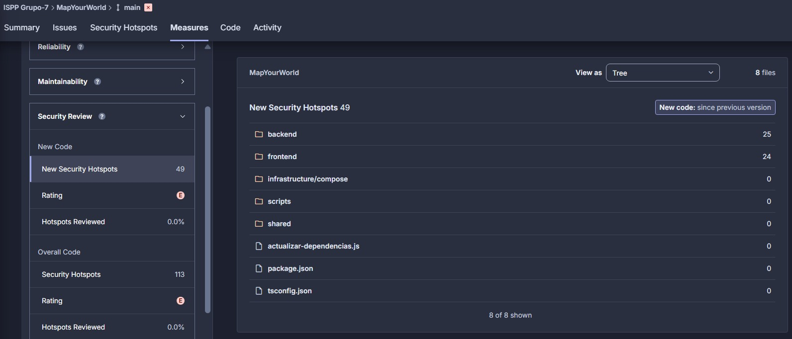
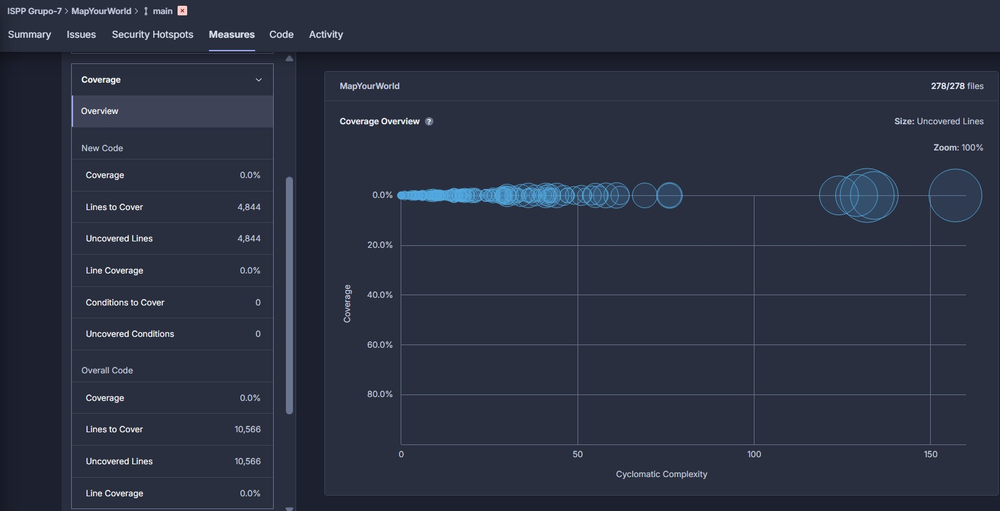

  
  

<h1 align="center">Informe de Análisis de Métricas de SonarQube</h1>

    Grupo 7

    ISPP-MapYourWorld

    Sprint 2

    Alejandro Aragón Sánchez

    26/03/2025

<h2>CONTROL DE VERSIONES</h2>

<table>
  <tr>
    <th>VERSIÓN</th>
    <th>FECHA</th>
    <th>COMENTARIOS</th>
    <th>AUTOR</th>
  </tr>
  <tr>
    <td>V1</td>
    <td>26/02/2025</td>
    <td>Primera versión</td>
    <td>Alejandro Aragón Sánchez</td>
  </tr>
    <tr>
    <td>V2</td>
    <td>27/02/2025</td>
    <td>Segunda versión</td>
    <td>Alejandro Aragón Sánchez</td>
  </tr>
</table>

<!-- omit in toc-->
# Índice
- [1. Descripción General](#1-descripción-general)
- [2. Análisis de Métricas Actuales](#2-análisis-de-métricas-actuales)
  - [2.1 Estado Actual de las Métricas](#21-estado-actual-de-las-métricas)
  - [2.2 Comparativa con Análisis Anteriores](#22-comparativa-con-análisis-anteriores)
  - [2.3 Identificación de Componentes Críticos](#23-identificación-de-componentes-críticos)
  - [2.4 Análisis de Vulnerabilidades y Seguridad](#24-análisis-de-vulnerabilidades-y-seguridad)
  - [2.5 Análisis de Deuda Técnica](#25-análisis-de-deuda-técnica)
- [3. Propuestas de Mejora y Acciones Prioritarias](#3-propuestas-de-mejora-y-acciones-prioritarias)
  - [3.1 Acciones Inmediatas](#31-acciones-inmediatas)
  - [3.2 Acciones a Medio Plazo](#32-acciones-a-medio-plazo)
  - [3.3 Acciones a Largo Plazo](#33-acciones-a-largo-plazo)
- [4. Conclusión](#4-conclusión)

# 1. Descripción General

El objetivo de este informe es realizar un análisis detallado de las métricas proporcionadas por SonarQube sobre el código del proyecto. Este análisis tiene como finalidad detectar problemas de calidad, identificar tendencias y proponer acciones de mejora en áreas como mantenibilidad, cobertura de tests, duplicación de código y vulnerabilidades. Las métricas analizadas incluyen:

- Bugs
- Code Smells
- Vulnerabilities
- Security Hotspots
- Coverage
- Duplications
- Technical Debt

# 2. Análisis de Métricas Actuales

## 2.1 Estado Actual de las Métricas

A continuación se presenta el estado actual de las métricas, obtenidas del análisis más reciente:

| **Métrica**           | **Valor Actual**        | **Descripción** |
|-----------------------|-------------------------|-----------------|
| **Bugs**              | **22 bugs en total** (14 nuevos desde la última versión) | 14 nuevos bugs en el código desde la última versión, distribuidos en las carpetas **backend** (13) y **frontend** (9). |
| **Code Smells**       | **583 code smells en total** (251 nuevos desde la última versión) | 251 nuevos code smells detectados, con una mayor concentración en **frontend** (134) y **backend** (117). |
| **Vulnerabilities**   | **1 vulnerabilidades en total** (0 nuevas desde la última versión) | No se han detectado vulnerabilidades nuevas en esta versión. |
| **Security Hotspots** | **113 code smells en total** (49 nuevos desde la última versión) | 49 nuevos hotspots detectados, principalmente en las carpetas **backend** (42) y **frontend** (34). |
| **Coverage**          | **0.0%**                | No se ha alcanzado cobertura en las pruebas de código; 11,000 líneas aún por cubrir (debido a que los tests se encuentran en la rama **develop** y serán introducidos próximamente en **main**). |
| **Duplications**      | **8.3%**                | El código duplicado representa el 8.3% de las 43,000 líneas analizadas. |
| **Technical Debt**    | **2h 46m de deuda técnica en total** (1h 10m nuevos desde la última versión) | La deuda técnica acumulada es de 1 hora y 10 minutos para el nuevo código desde la última versión. La deuda total es de 2 horas y 46 minutos. |

## 2.2 Comparativa con Análisis Anteriores

El análisis muestra que las métricas han empeorado desde la última versión, destacándose un incremento en el número de **Bugs** y **Code Smells**, y la adición de nuevos **Security Hotspots**. A pesar de esto, no se han detectado nuevas **Vulnerabilities**.

#### Gráfica de Evolución de Métricas

- **Evolución de Bugs**: 14 nuevos bugs detectados.

- **Evolución de Code Smells**: 251 nuevos code smells.

- **Evolución de Vulnerabilities**: No se han detectado nuevas vulnerabilidades.

- **Evolución de Security Hotspots**: 49 nuevos hotspots detectados.

- **Evolución de Coverage**: 0% de cobertura, sin cambios.

- **Evolución de Duplications**: 8.3% de duplicación.

## 2.3 Identificación de Componentes Críticos

A continuación, se destacan los archivos y módulos con el mayor número de problemas detectados en el código:

| **Componente**          | **Problemas Detectados** | **Deuda Técnica** | **Impacto Potencial** |
|-------------------------|--------------------------|-------------------|-----------------------|
| **backend**             | 13 nuevos bugs, 117 code smells, 42 hotspots | 2h 5min en deuda técnica | Requiere atención inmediata para mejorar la estabilidad y la calidad. |
| **frontend**            | 9 nuevos bugs, 134 code smells, 34 hotspots | 41min en deuda técnica | Alta cantidad de code smells que impacta la calidad y mantenibilidad. |

## 2.4 Análisis de Vulnerabilidades y Seguridad

Se han identificado **0 nuevas vulnerabilidades** en esta versión del código. Sin embargo, había una **vulnerabilidad previa** por el uso del cifrado simétrico (AES-256-CBC) que podría comprometer la seguridad del sistema si no se maneja correctamente. Además, se han añadido **49 nuevos security hotspots**, los cuales deben ser revisados y priorizados según su nivel de riesgo. A continuación, se detallan las categorías de todos los hotspots:

| **Categoría**                 | **Cantidad** | **Prioridad** |
|-------------------------------|--------------|---------------|
| **Authentication**             | 42           | Alta          |
| **Command Injection**          | 16           | Media         |
| **Denial of Service (DoS)**    | 14           | Media         |
| **Weak Cryptography**          | 14           | Media         |
| **Encryption of Sensitive Data** | 3            | Baja          |
| **Insecure Configuration**     | 8            | Baja          |
| **Others**                     | 16           | Baja          |

## 2.5 Análisis de Deuda Técnica

La deuda técnica acumulada es significativa, especialmente en los componentes de **backend** y **frontend**, con un total de **2h 46m** de deuda técnica. Se recomienda abordar los problemas críticos de manera prioritaria para mejorar la estabilidad y calidad del sistema.

# 3. Propuestas de Mejora y Acciones Prioritarias

Con base en el análisis de las métricas, se proponen las siguientes acciones para mejorar la calidad del código y reducir la deuda técnica:

## 3.1 Acciones Inmediatas

1. **Corrección de Bugs Críticos**: Priorizar la corrección de los 14 nuevos bugs detectados, especialmente aquellos en **backend** y **frontend**.
2. **Reducción de Code Smells**: Reducir los 251 nuevos code smells que afectan la calidad del código, con enfoque en **frontend** y **backend**.
3. **Revisión de Security Hotspots**: Realizar una revisión urgente de los **49 nuevos security hotspots**, comenzando con aquellos de **alta prioridad** (42 relacionados con **Authentication** y 16 de **Command Injection**).

## 3.2 Acciones a Medio Plazo

1. **Reducción de Deuda Técnica**: Resolver la deuda técnica acumulada (1h 10m en el nuevo código y 2h 46m en total).
2. **Aumento de Cobertura de Pruebas**: Implementar pruebas unitarias y de integración para aumentar la cobertura y asegurar la estabilidad del sistema.
3. **Eliminación de Código Duplicado**: Reducir la duplicación de código para mejorar la mantenibilidad.

## 3.3 Acciones a Largo Plazo

1. **Monitoreo Continuo de Métricas**: Establecer un proceso continuo de monitoreo de calidad del código utilizando SonarQube para detectar problemas de forma temprana.
2. **Capacitación en Buenas Prácticas de Desarrollo**: Promover buenas prácticas de codificación entre los desarrolladores para reducir la incidencia de bugs y mejorar la calidad del código.

# 4. Conclusión

El análisis ha revelado que el proyecto está enfrentando un aumento en los **Bugs** y **Code Smells**, así como un incremento en los **Security Hotspots**. Las acciones inmediatas deben centrarse en la corrección de los errores críticos, la reducción de la deuda técnica y la mejora de la cobertura de pruebas. La implementación de estas medidas permitirá mejorar la calidad y seguridad del código a largo plazo.

