

  
  

<h1 align="center">Guia de Revisión</h1>

    Grupo 7

    ISPP-MapYourWorld

    Sprint 3

     Ángel Neria Acal, José María Baquero Rodríguez

    09/04/2025

---
**CONTROL DE VERSIONES**

| VERSIÓN | FECHA     | COMENTARIOS              | AUTOR              |
|---------|-----------|--------------------------|--------------------|
| V1      | 09/04/2025| Primera versión          | Ángel Neria Acal y José María Baquero Rodríguez     |

---
## 1. Mapeo Explícito de Casos de Uso (UC) a Interacciones

### 1.1. No Matchmaking

- **Bienvenida**:  
  El usuario tiene la opción de iniciar sesión con una cuenta existente o registrarse en el sistema con una nueva cuenta. También se peude realizar una gestión del usu de cookies.
  
  *(Caso de uso implementado en #S2)*

- **(Mejora) Registro**:  
  El usuario se registra en el sistema proporcionando su nombre, correo electrónico y contraseña a través de un formulario. Para completar el registro es necesario que el nuevo usuario lea y acepte los términos y condiciones de uso. Como mejora el usuario puede añadir una imagen de perfil.
  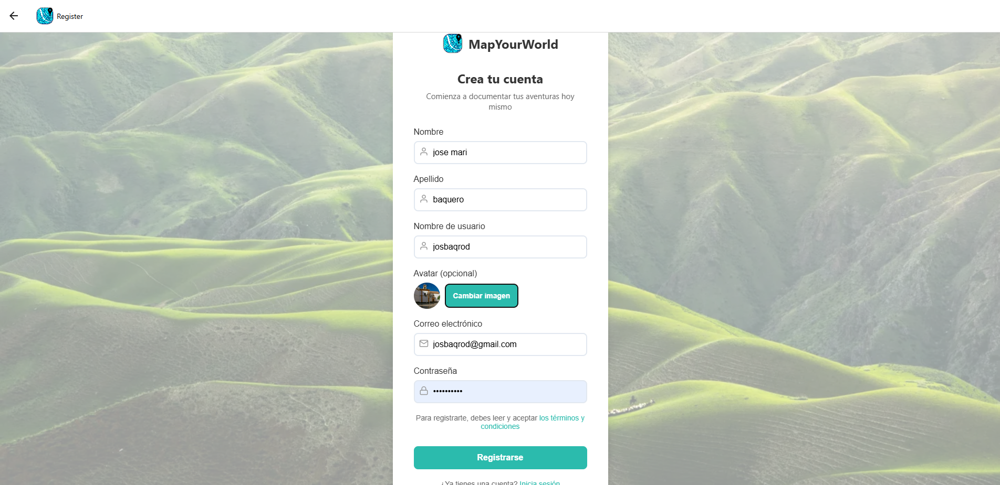
 *(Caso de uso implementado en #S2)*
  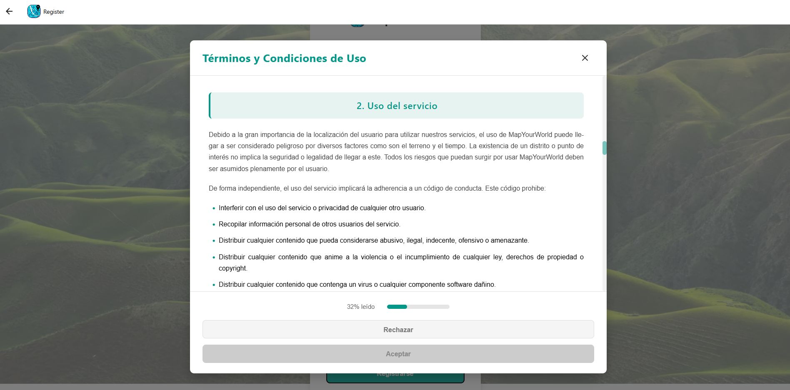
  *(Caso de uso implementado en #S2)*

- **Login**:  
  El usuario inicia sesión en el sistema introduciendo el correo y contraseña con el que previamente se ha debido registrar en el sistema. 
  
  *(Caso de uso implementado en #S2)*

- **Exploración de zonas no descubiertas**:  
  El usuario se desplaza físicamente hacia la zona que quiere descubrir. Al llegar a la ubicación, el sistema detecta su presencia y automáticamente desbloquea la localización en su mapa personal pintandola de color verde. La posición actual del usuario se indica con un marcador en el mapa.
  
  *(Caso de uso implementado en #S1)*
  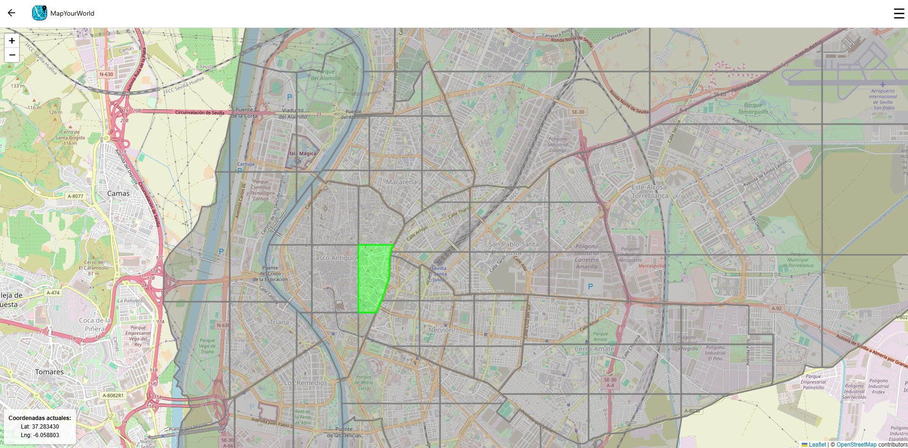
  *(Caso de uso implementado en #S1)*

- **(Mejora) Registro de puntos de interés**:  
  El usuario selecciona una zona del mapa desbloqueada en la que desea añadir un punto de interés. Al tocar la ubicación, se muestra una ventana emergente con un formulario donde debe añadir un nombre y una descripción, una categoría, que es opcional y fotografías, también opcionales. Una vez completado el proceso, el punto de interés queda registrado y aparece en el mapa interactivo con un marcador. Como mejora se ha adaptado el estilo del fromulario al estilo general de la web, además ahora se captura la suscripción del usuario y en caso de no tener una suscripción premium, el usuario solo podrá crear un punto de interés pòr distrito.
  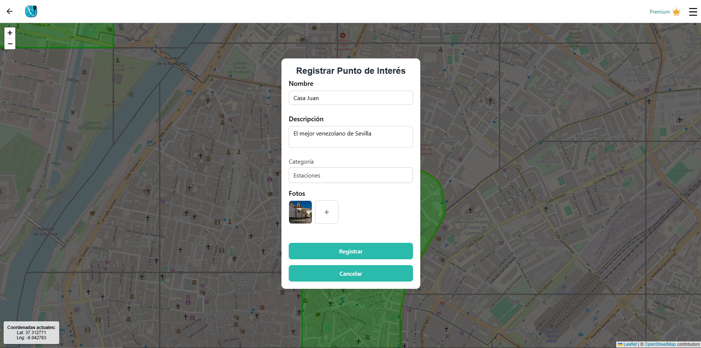
  *(Caso de uso implementado en #S1)*

  Además se ha mejorado el estilo de los puntos de interés creados, siendo más descriptivos con la categoría que tiene asociada.
  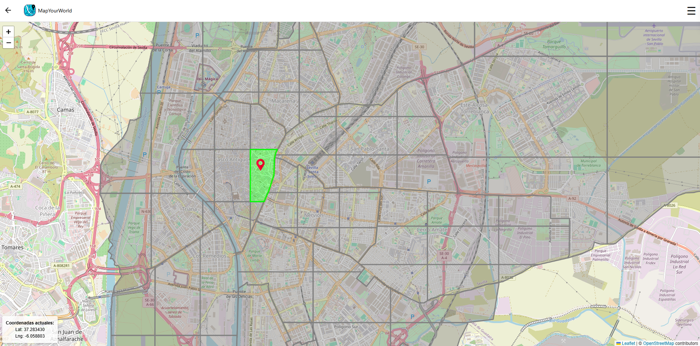
  *(Caso de uso implementado en #S1)*

- **(Mejora) Suscripción**:
  El usuario puede acceder a la pantalla de suscripción a Premium desde la opción "Hazte Premium" situado en la esquina superior derecha. Como mejora encontramos que ahora la opción es mucho más llamativa.
   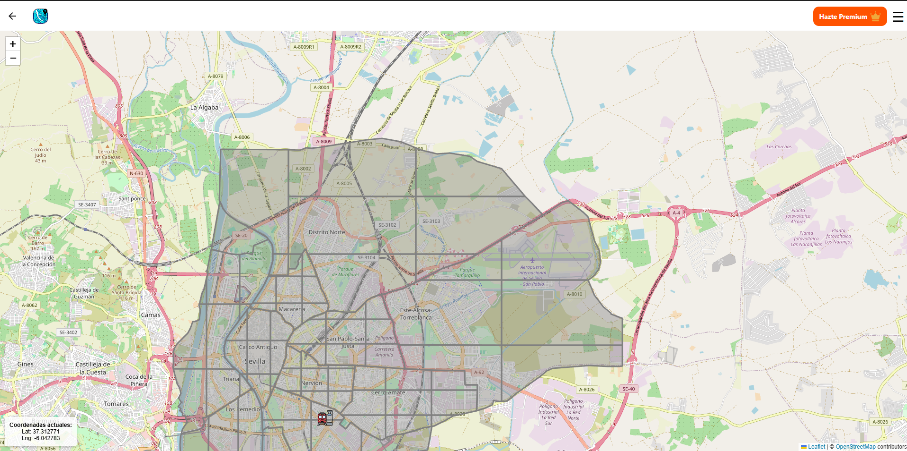
  *(Caso de uso implementado en #S2)* 
   
   Al entrar, visualizará información sobre los beneficios de ser Premium y un botón "Pagar con Stripe", que le permitirá iniciar el proceso de pago. Al pulsarlo, aparecerá la pasarela de pago de Stripe, donde deberá ingresar sus datos y confirmar la transacción. Como mejora se ha adaptado el estilo de esta pantalla al estilo general de la web.  
   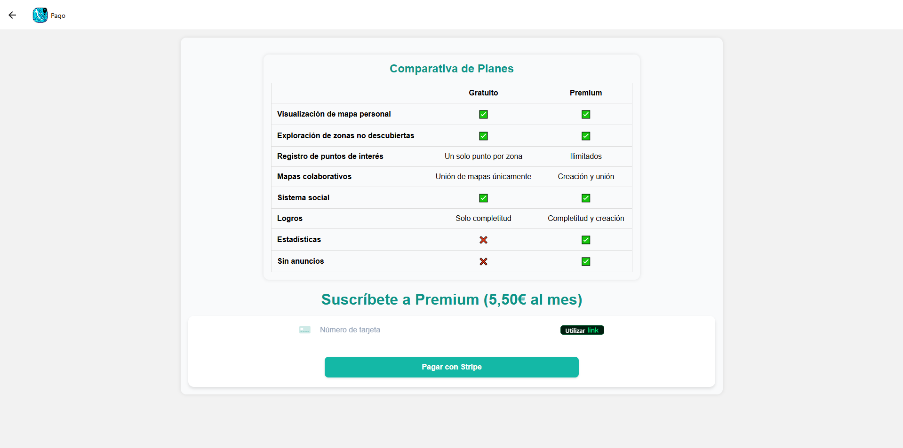
  *(Caso de uso implementado en #S2)* 

  Una vez completado el pago con éxito, el sistema actualizará su estado a Premium y lo llevará a su mapa. Como mejora ahora encontramos que junto al menú desplegable se indica que el usuarios es "Premium".
  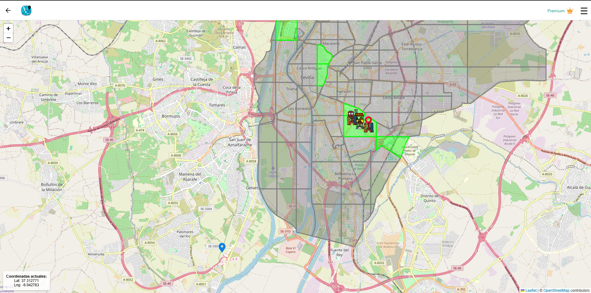
  *(Caso de uso implementado en #S2)*

  
  Si el usuario selecciona esta opción de "Premium" se le indica que ya es miembro Premium y se muestra un botón "Ir a mi mapa", que le permitirá acceder a sus mapas y disfrutar de las ventajas exclusivas de los miembros Premium.
   
  *(Caso de uso implementado en #S2)*

- **(Nuevo) Estadísticas**:
  El usuario puede acceder a la pantalla de estadísticas pulsando en "Estadísticas" en el menú desplegable de la esquina superior derecha.
  En esta pantalla se mustra una tabla con el total de logros alcanzados, el núemro de amigos actuales del usuario, el total de puntos de interés que ha registrado el usuario entre todos los mapas a los que pertenece, el total de distritos desbloqueados y el número de mapas colaborativos a los que se ha unido. Esta funcionalidad es exclusiva de usuarios premium.
   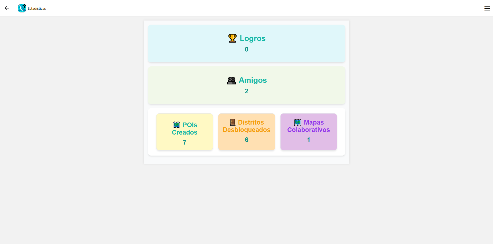
  *(Caso de uso implementado en #S3)*

- **(Nuevo) Logros**:
  El usuario puede acceder a la pantalla de logros pulsando en "Estadísticas" en el menú desplegable de la esquina superior derecha.
  En esta pantalla se muestran dos secciones, "Logros obtenidos", "Todos los logros" y la opcion de crear sus propios logros. Mecionar que la posibilidad de crear logros es exclusiva para los usuarios premium.
    En la sección de "Logros obtenidos" se muestran listados los logros que el usuario ha desbloqueado.

   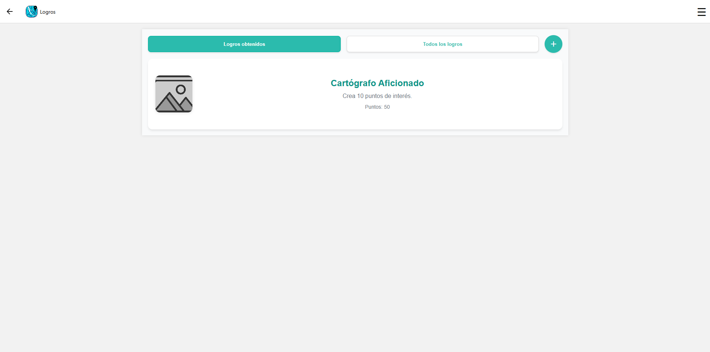
  *(Caso de uso implementado en #S3)*

  En la sección de "Todos los logros" se muestran listados todos los logros disponibles para desbloquear junto con uan descripción de cómo se desbloquea cada logro.
   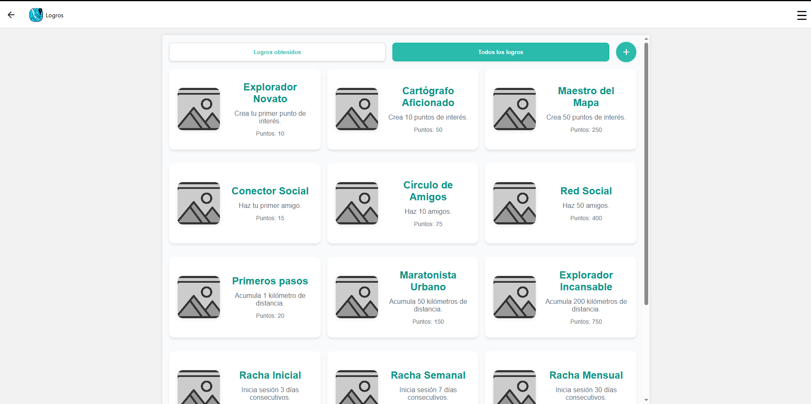
  *(Caso de uso implementado en #S3)*

  Si el usuario crea un nuevo logro pulsando sobre el boton "+" en la parte superior derecha, se muestra un formulario donde debe indicar el nombre del logro, una descripción, los puntos de ese nuevo logro y la url para la imagen de logo que tendrá el logro creado.
  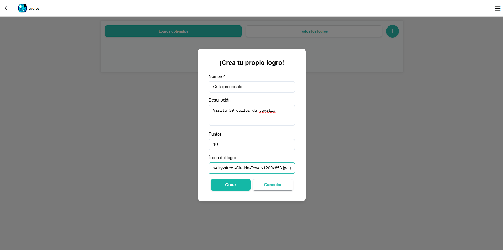
  *(Caso de uso implementado en #S3)*

### 1.2. Matchmaking

- **Administrador**:
  Los administradores de MapYourWorld gestionan la publicidad añadiendo puntos de interés en el mapa para las empresas que solicitan promoción. Desde el Panel de Administración, pueden registrar un negocio completando un formulario con su nombre, descripción, categoría y coordenadas. Tras validar la información, hacen clic en "Guardar Comercio", y el negocio queda registrado en el sistema, apareciendo en los mapas accesibles para los usuarios.

 
  *(Caso de uso implementado en #S2)*

- **(Mejora) Publicidad de empresas**:  
  Las empresas que quieran aparecer en los mapas como puntos de interés tienen disponible la opción de "Publicítate con nosotros". Para ello solo deben rellenar un formulario con nombre, correo de contacto, descripción del local o empresa a publicitar y las coordenadas donde se ubica el mismo. Este formulario se envía por correo a la cuenta corporativa de MapYourworld para que los adminitradores del sistema puedan añadirlo. Como mejora ahora encontramos que para localizar un negocio se usa la dirección del mismo, cosa que es más natural que indicar las coordenadas, tal y como se hacía en la versión anterior.
  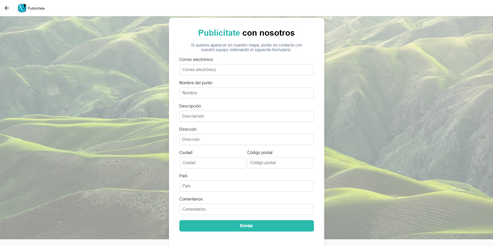
  *(Caso de uso implementado en #S2)*

- **(Mejora) Social:**
  El usuario puede acceder al apartado de Social desde el menú desplegable en la esquina superior derecha. 
 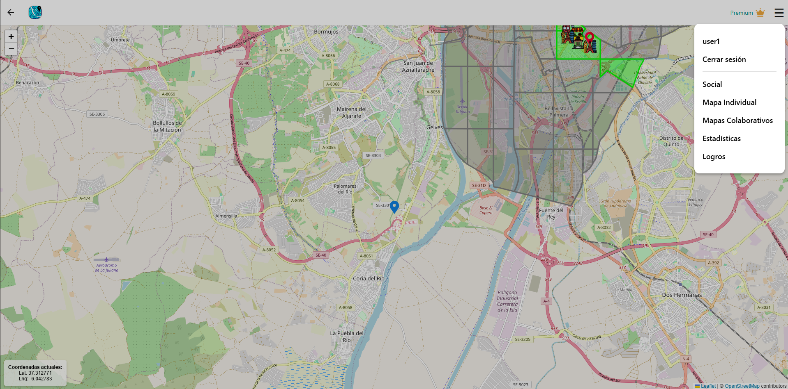
  *(Caso de uso implementado en #S2)* 

  En la sección Amigos, se muestra un listado con los amigos agregados. Como mejora se ha modificado el estilo de la pantalla y se ha añadido más información de los amigos a petición de los usuarios piloto.
 
  *(Caso de uso implementado en #S2)* 

  En Solicitudes, el usuario puede ver tanto las peticiones de amistad recibidas como las invitaciones a mapas enviadas por sus amigos, pudiendo aceptarlas o rechazarlas. 
  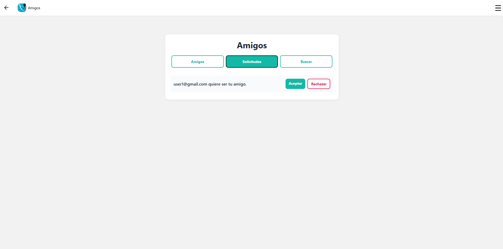
  *(Caso de uso implementado en #S2)* 

  En Buscar, el usuario puede encontrar a otros miembros de la plataforma escribiendo su nombre de usuario en la barra de búsqueda y pulsando el botón Buscar. Si el usuario existe, se mostrará su correo junto a un botón Agregar, que enviará una solicitud de amistad a dicho usuario.
   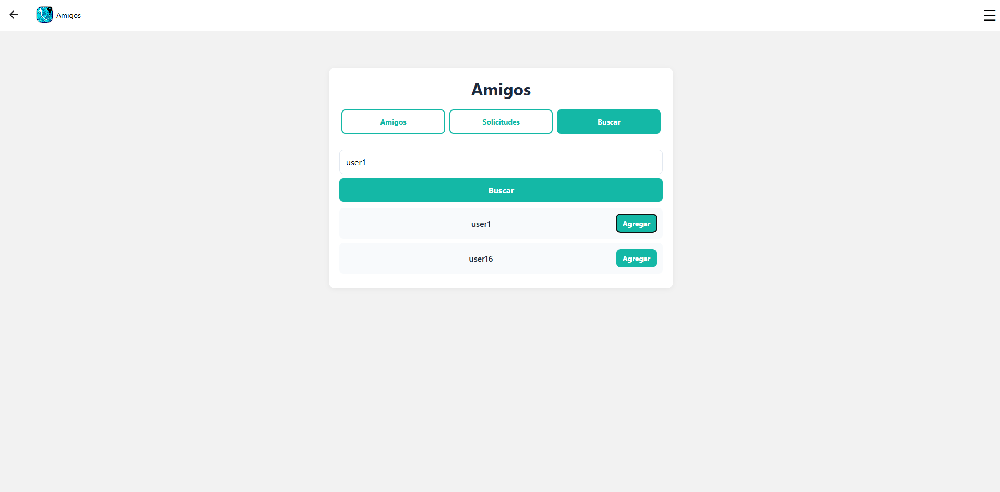
  *(Caso de uso implementado en #S2)* 

- **(Mejora) Participación en mapas colaborativos:**
  El usuario registrado puede acceder a la sección de mapas colaborativos desde el menú desplegable de la esquina superior derecha de su pantalla.
  
  *(Caso de uso implementado en #S2)*
  
  Tras seleccionar la opción "Mapas Colaborativos", aparece una pantalla donde se listan los mapas colaborativos a los que pertenece el usuario, además de las opciones de eliminar dicho mapa o crear un nuevo mapa.
  
  *(Caso de uso implementado en #S2)*

  Si el usuario crea un nuevo mapa colaborativo pulsando sobre el boton "+" en la parte superior derecha, se muestra un formulario donde debe indicar el nombre del mapa, una descripción e indicar el número de usuarios máximos  que pueden formar parte de dicho mapa. Como mejora, se ha limitado esta funcionalidad a usuarios premium y se han corregido errores a la hora de insertar el texto en los apartados.
  
  *(Caso de uso implementado en #S2)*

  Si el usuario pulsa sobre alguno de los mapas colaborativos que aparecen listados pasa a visualizar el progreso de dicho mapa, viendo en la parte superior derecha una leyenda que indica el color asociado a las zonas descuniertas por el resto de usuarios que formen parte del mapa colaborativo. También dispone de las funcionalidades de invitar a otros usuarios, que tenga previamente añadidos como amigos, y recargar datos, las cuales estan disponibles en la parte inferior de la pantalla.
  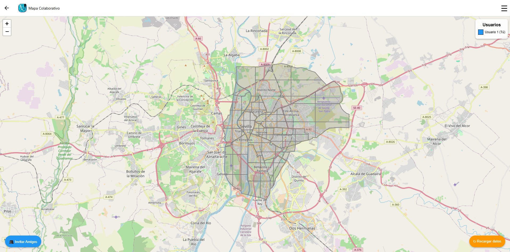
  *(Caso de uso implementado en #S2)*

  Si desde dentro de un mapa colaborativo el usuario pulsa el boton de "Invitar Amigos" situado en la parte inferior de la pantalla, se muestra un listado de los amigos del usuario y junto a cada uno de los amigos la opción "Invitar" que le enviará una invitación a ese amigo al mapa actual desde el que se envía. Se ha mejorado el formulario para invitar amigos, ahora se listan solo los amigos que no forman parte de ese mapa.
  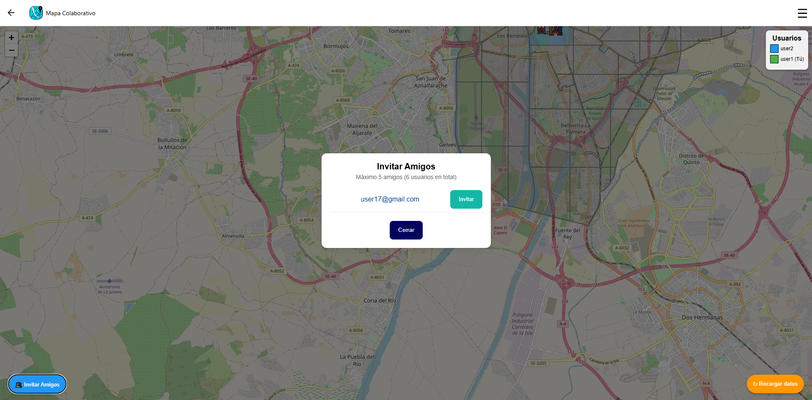
  *(Caso de uso implementado en #S2)* 

  Esta solicitud le aparecerá al usuario amigo en la sección de social en el apartado de Solicitudes.
  
  *(Caso de uso implementado en #S2)*

  El usuario que se una al mapa podrá ver el progreso del mismo visualizando las diferentes zonas coloreadoas del color asociado a cada uno del resto de usuario que forman parte del mapa colaborativo. Estos colores están disponibles en la leyenda que aparece en la parte superior derecha de la pantalla.
  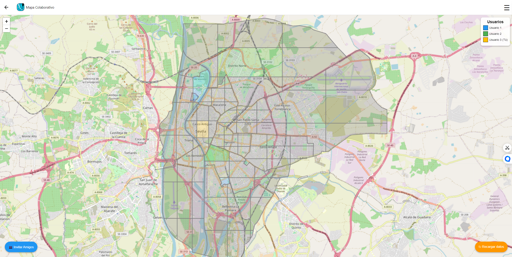
  *(Caso de uso implementado en #S2)*

---

## 2. Datos Necesarios para Realizar la Revisión

- **URL de la página de inicio (Landing Page):** [Landing Page de MapYourWorld](https://mapyourworld.netlify.app/)  
  

- **Plataforma de Despliegue:**
  - **URL Primer despliegue:** [Despliegue de MapYourWorld](https://app1g.mapyourworld.es)
  - **URL Segundo despliegue:** [Despliegue de MapYourWorld](https://app2g.mapyourworld.es)
  - **URL Tercer despliegue:** [Despliegue de MapYourWorld](https://app3.mapyourworld.es)
  - **Credenciales:**  
    - **Usuario 1:**  
    - Correo electrónico: `usuarioprueba1@gmail.com`  
    - Contraseña: `Usuarioprueba12345*`

  - **Usuario 2:**  
    - Correo electrónico: `usuarioprueba2@gmail.com`  
    - Contraseña: `Usuarioprueba12345*`

  - **Administrador:**  
    - Correo electrónico: `administradorprueba1@gmail.com`  
    - Contraseña: `Administradorprueba12345*`

  - **Plataforma de pago:**
    - Número de tarjeta: `4242 4242 4242 4242`
    - Fecha: `08/28`
    - CVC: `123`
    - Código postal:`41410`

- **Repositorio en GitHub:**  
  - **URL:** [Repositorio de MapYourWorld](https://github.com/ISPP-Grupo-7/MapYourWorld)

- **Herramienta de Seguimiento de Tiempo:**
  - **URL:** [Reporte de Clockify](https://app.clockify.me/shared/67d1d4ef61753b24b9d8d838)  
  
---

## 3. Requisitos Potenciales para Usar el Sistema

- Activar el acceso a la localización.
- Activar el acceso a la galería de imágenes si desea subir alguna foto asociada a algún punto de interés.

---

## 4. Demo de la Evaluación

- **URL:** [Demo de MapYourWorld](https://youtu.be/-NMG96XzjbQ)

## 5. Acceso al despliegue

- Actualmente, la aplicación web se encuentra desplegada en una instancia de máquina virtual de Google Cloud. Para acceder, se requiere conectarse mediante **ssh** a la dirección IP de la máquina virtual. La autenticación se realiza mediante una clave RSA privada que se adjunta. El comando completo es el siguiente:

`ssh -i google_cloud_key francodellaguila00@34.42.143.166`

Concretamente, el proceso de node (llamado mapyourworld) está gestionado por la herramienta **PM2**. Para comprobar el estado del proceso, se puede ejecutar el siguiente comando:

`pm2 list`

---
