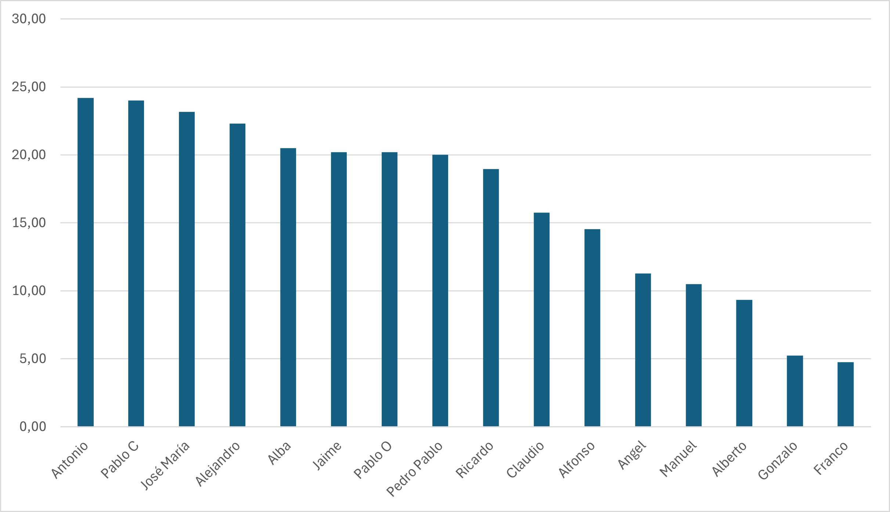
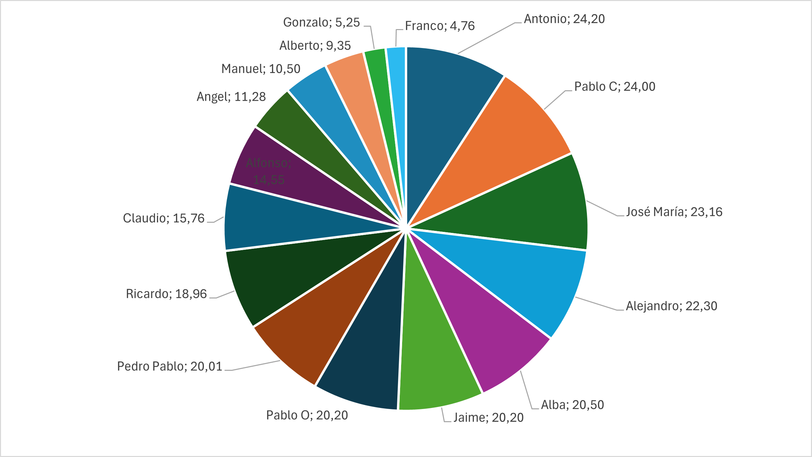

  
  

<h1 align="center">Reporte de horas</h1>

    Grupo 7

    ISPP-MapYourWorld

    Sprint 3

    Alfonso Luis Alonso Lanzarán

    10/04/2025

**CONTROL DE VERSIONES**

| VERSIÓN | FECHA     | COMENTARIOS              | AUTOR              |
|---------|-----------|--------------------------|--------------------|
| V1      | 10/04/2025| Primera versión          | Alfonso Luis Alonso Lanzarán |

<!-- omit in toc-->
# Índice
- [Índice](#índice)
  - [1. Resumen ejecutivo](#1-resumen-ejecutivo)
  - [2. Explicación de las horas excesivas o escasas de los miembros](#2-explicación-de-las-horas-excesivas-o-escasas-de-los-miembros)
  - [3. Gráficas del tiempo invertido](#3-gráficas-del-tiempo-invertido)
    - [3.1. Gráfico de barras](#31-gráfico-de-barras)
    - [3.2. Gráfico de sectores](#32-gráfico-de-sectores)
  - [4. Datos originales exportados de clockify](#4-datos-originales-exportados-de-clockify)

## 1. Resumen ejecutivo

En este documento se muestra la cantidad de horas invertidas en el proyecto por cada miembro del equipo, en el siguiente punto se comentan los desvíos de las horas planificadas para este sprint (20 horas)

NOTA: El "pantallazo" de las horas ha sido tomado el día 10/04 a aproximadamente las 19:00

## 2. Explicación de las horas excesivas o escasas de los miembros
Durante este Sprint prácticamente todo el equipo ha trabajado más de las 20 horas planificadas por la asignatura, las funcionalidades se han terminado lo que ha conllevado una mayor carga de trabajo principalmente en quienes han desarrollado el mapa colaborativo.
Para el tercer sprint las personas que están cerca de completar sus 150 horas terminarán las tareas que dependan de ellos y no realizarán más a excepción de que se les requiera para correcciones puntuales.
Con los miembros que tienen horas suficientes disponibles se realizarán las tareas correspondientes al WPL y demás fases restantes del proyecto.

## 3. Gráficas del tiempo invertido

### 3.1. Gráfico de barras

### 3.2. Gráfico de sectores

## 4. Datos originales exportados de clockify

Se pueden encontrar en (Documentación sobre el equipo/Datos originales clockify.pdf)