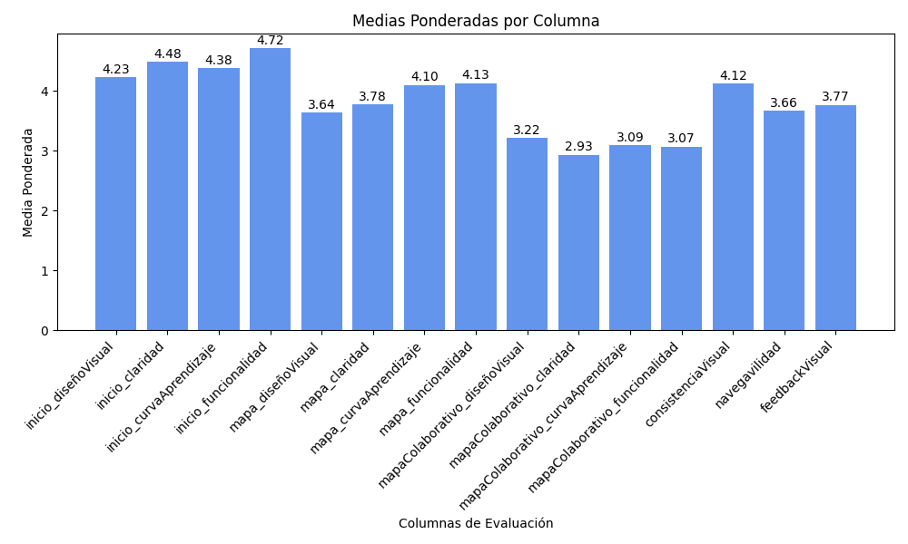
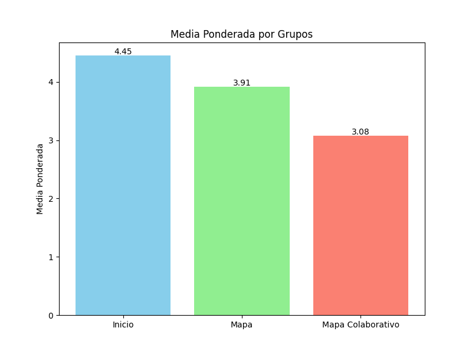
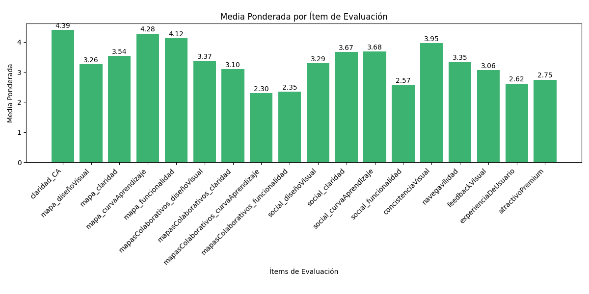
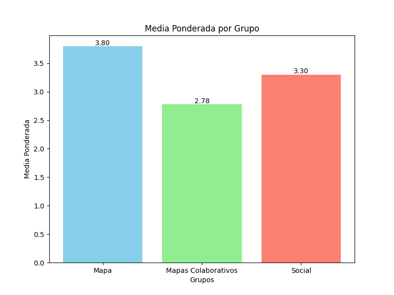
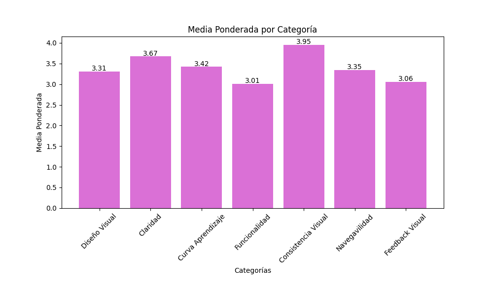
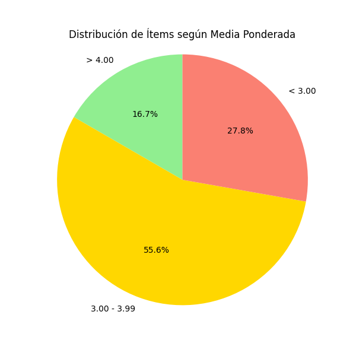

  
  

<h1 align="center">Análisis de respuestas de los usuarios piloto</h1>

    Grupo 7

    ISPP-MapYourWorld

    Sprint 3

    Claudio Gonzalez Benito

    06/04/2025

**CONTROL DE VERSIONES**

| VERSIÓN | FECHA     | COMENTARIOS              | AUTOR              |
|---------|-----------|--------------------------|--------------------|
| V1      | 20/03/2025| Primera versión          | Claudio Gonzalez Benito |
| V2      | 22/03/2025| Encuesta 2 | Claudio Gonzalez Benito |
| V3      | 22/03/2025| Encuesta 3 | Claudio Gonzalez Benito |

<!-- omit in toc-->
# Índice

- [Índice](#índice)
- [1. Objetivo general del documento](#1-objetivo-general-del-documento)
  - [1.1. Medición de éxito](#11-medición-de-éxito)
  - [1.2. Tareas de respuesta](#12-tareas-de-respuesta)
  - [1.3. Medición del progreso](#13-medición-del-progreso)
  - [1.4. Priorizacion del feedback](#14-priorizacion-del-feedback)
- [2. Encuesta 1: mockups](#2-encuesta-1-mockups)
  - [2.1. Objetivo](#21-objetivo)
  - [2.2. Resultados](#22-resultados)
  - [2.3. Medición de los resultados](#23-medición-de-los-resultados)
  - [2.4. Tareas a implementar](#24-tareas-a-implementar)
  - [2.5. Nota final y conclusiones](#25-nota-final-y-conclusiones)
- [3. Encuesta 2: primera version](#3-encuesta-2-primera-version)
  - [3.1. Objetivo](#31-objetivo)
  - [3.2. Resultados](#32-resultados)
  - [3.3. Medición de los resultados](#33-medición-de-los-resultados)
  - [3.4. Tareas a implementar](#34-tareas-a-implementar)
  - [3.5. Nota final y conclusiones](#35-nota-final-y-conclusiones)
- [4. Encuesta 3: segunda version](#4-encuesta-3-segunda-version)
  - [4.1. Objetivo](#41-objetivo)
  - [4.2. Resultados](#42-resultados)
  - [4.3. Medición de los resultados](#43-medición-de-los-resultados)
  - [4.4. Tareas a implementar](#44-tareas-a-implementar)
  - [4.5. Nota final y conclusiones](#45-nota-final-y-conclusiones)

# 1. Objetivo general del documento

El objetivo del documento es establecer unas métricas para cada encuesta o en global que permitan saber si se están cumpliendo los objetivos que se quieren medir con el feedback sobre la aplicación y si debemos reaccionar al feedback de nuestros usuarios piloto con tareas para el equipo de implementación. Esto incluye no solo unas medidas basadas en sus respuestas para evaluar si algo es aceptable o requiere mejora, sino también métricas globales para maximizar el valor del feedback y mejorar la aplicación en general.

## 1.1. Medición de éxito
- Para cada pregunta o apartado individual se miden todos sobre 5. Si la media de todas las respuestas está entre 4-5, ese apartado es un éxito. Entre 3-3.99 se considera mejorable y menos de un 3 se considera un problema.
- Para la encuesta en global, se asigna una nota basada en el porcentaje de apartados individuales exitosos o mejorables (que valdran la mitad) sobre el 100%, de tal forma que si por ejemplo el 70% son un exito, 20% mejorables y 10% fallo, la nota de la encuesta sera de 7(exito)+1(mejorable)=8. Se considera un éxito general si supera el 8, mejorable entre 5 y 8, y un fallo si está por debajo del 5.

## 1.2. Tareas de respuesta
Se implementarán tareas de respuesta para cada apartado individual no exitoso. La prioridad será media si es mejorable y alta si es un problema. Los apartados similares podrán agruparse en una misma tarea, pero sin perder trazabilidad gracias a las tablas y descripciones detalladas. Tambien a partir de la tercera encuesta en adelatnte se reflejara en este documento tareas de arreglos de errores que encuentran los usuarios piloto (antes tambien se contemplaban pero se informaba directamente al equipo envez de retratarlo en este documento) 

## 1.3. Medición del progreso
Si es posible realizar un mapeo de un apartado concreto a lo largo del tiempo, se hará para evaluar si ha mejorado, empeorado o si se ha reaccionado adecuadamente a problemas detectados.

## 1.4. Priorizacion del feedback
Debido a la naturaleza de como obtenemos a nuestros usarios piloto, no siempre se asimilan a nuestro publico objetivo. Con el fin de priorizar el feedback de las personas que si pueden estar interesadas en nuestra aplicacion, se han hecho un conjunto de preguntas con el fin de medir cuanto se acercan los usuarios piloto a nuestro usuario piloto ideal, y todas las medias seran medias ponderadas usando ese coeficiente para darle mas peso al feedback de nuestro publico objetivo.

# 2. Encuesta 1: mockups

## 2.1. Objetivo
Medir la calidad de los mockups y evaluar si es necesario mejorar algo. También se buscará, más adelante, evaluar el progreso del prototipo respecto a lo implementado en la aplicación real.

## 2.2. Resultados

Se hace un desgloce de los resultados por apartados  indidualmente, y luego agrupados por tema de mockup y luego en general de todos los mockups 

Nota de todos los apartados para cada mockup

Nota media por par de mockups

Nota media de todos los mockups

## 2.3. Medición de los resultados

Todos los apartados son un exito. 

## 2.4. Tareas a implementar

Ya que ningun criterio esta por debajo del 4, no se han creado tareas en respuesta a esta encuesta

| Cosa que se debe mejorar | Tarea creada | Número de issue (si procede) | Equipo | Prioridad |
|--------------------------|--------------|-------------------------------|--------|-----------|

## 2.5. Nota final y conclusiones

Viendo los resultados y siendo la nota se satisfaccion un 10 (100% de apartados en exito), se considera que los mockups estan bien diseñados y que no hace falta mejorar nada urgentemente. Idealmente, si se traducen estos mockups ups a la implementacion, la interfaz deberia estar bajo los mismos niveles de calidad.

# 3. Encuesta 2: primera version

## 3.1. Objetivo
Medir la calidad de la interfaz y funcionalidad de la primera version de la aplicacion, centrandonos en ambitos concretos como la navegabilidad, diseño visual, consistencia visual, curva de aprendizaje ect

## 3.2. Resultados

Se hace un desgloce de los resultados por apartados indidualmente, y luego agrupados por conjunto de pantallas y luego por apartado individual que se queria medir en el ambito global de la aplicacion

Nota de todos los apartados

Nota agrupacion de pantallas

Nota media de todos los atributos en global

## 3.3. Medición de los resultados

El 46.7% son un exito, otro 46.7% son mejorables, y 6.7% son un fracaso

## 3.4. Tareas a implementar

Se han propuesto las siguientes taras en respuesta a las estadisticas resultantes, y se validaran y pondran en marcha por los coordinadores de cada grupo

| Cosa que se debe mejorar | Tarea creada | Número de issue (si procede) | Equipo | Prioridad | Descripcion |
|--------------------------|--------------|-------------------------------|--------|-----------|-------------------|
|Claridad, diseño visual, curva de aprendizaje y funcionalidad en la pantalla de mapas colaborativos| (link cuando se cree)|(poner cuando se cree)|Frontend y Backend(si es necesario)|media| Unificar estilos con el resto de la app, tomando de referencia los mock ups o pantalla de inicio, buscando entre otras cosas suavizar los colores|
|Claridad, diseño visual en la pantalla de mapas| (link cuando se cree)|(poner cuando se cree)|Frontend|media| Hacer que los puntos de interes tengan un estilo visual mas atractivo|
|Navegabilidad y feedback visual en la app en general| (link cuando se cree)|(poner cuando se cree)|Frontend|media|Implementar animaciones y tutoriales de primer uso (si da tiempo)|

## 3.5. Nota final y conclusiones

Viendo los resultados y siendo la nota de satisfaccion un 4.67+2.34=7.01, significa que el resultado de la encuesta en global es mejorable, lo que indica que debemo mejorar y esperamos que con las tareas que se asignen se puedan mejorar estas metricas

# 4. Encuesta 3: segunda version

## 4.1. Objetivo
Medir la calidad de la interfaz y funcionalidad de la segunda version de la aplicacion,quitando las pantallas de registro y inicio de la eccuacion ya que cumplen todos los estandares que esperamos. Ademas se mide la claridad del custumer agrement y lo atractivas que son las ventajas de hacerse premium

## 4.2. Resultados

Se hace un desgloce de los resultados por apartados indidualmente, y luego agrupados por conjunto de pantallas y luego por apartado individual que se queria medir en el ambito global de la aplicacion

Nota de todos los apartados

Nota agrupacion de pantallas

Nota media de todos los atributos en global

## 4.3. Medición de los resultados

El 16.7% son un exito, otro 55.6% son mejorables, y 27.8% son un fracaso

## 4.4. Tareas a implementar

Se han propuesto las siguientes taras en respuesta a las estadisticas resultantes, y se validaran y pondran en marcha por los coordinadores de cada grupo

| Cosa que se debe mejorar | Tarea creada | Número de issue (si procede) | Equipo | Prioridad | Descripcion |
|--------------------------|--------------|-------------------------------|--------|-----------|-------------------|
|Diseño visual y claridad en general menos registro |||frontend|media|1.En los planes Utilizar colores más diferenciados, íconos claros o un diseño más compacto para facilitar la comparación rápida entre los planes, indicar cuanto se va a pagar o si es pago unico o mensual y evitar en móviles se vea pegado a la parte inferior y cueste verlo. 2.Los términos y condiciones en el móvil cuestan leerlos. Esto puede ser porque el texto de los términos y condiciones ocupa poco comparado con todo el modal. 3.Iconos mas adecuados para el poi de monumentos, y añadirles a todos un fondo muy sutil para que el propio icono no se mezcle con los tonos del mapa. 4.En el establecimiento de puntos de interes en el mapa colaborativo arreglar los estilos. 5.Mejorar el select a la hora de elegir categoria en un punto de interés|
|Curva de aprendizaje y funcionalidad en mapas colaborativos|||Frontend|media|1.Editar sus propios puntos de interés ya registrados en el mapa.2.En mapas colaborativos poder ver quien a puesto cada punto de interés y que se vea la foto si alguien la sube|
|Social funcionalidad y curva de aprendizaje|||Frontend|alta|1.Mostrarse el nombre de usuario en algún lugar visible de la aplicación.2.Mostrar un poco más de información sobre cada amigo.|
|Consistencia visual en toda la app|||Frontend|media|Consolidar un poco mas los estilos|
|Feedback visual|||Frontend|media|avisos de "Notificacion enviada" cuando se envían solicitudes|
|Navegabilidad|||Frontend|media|1.Organizar las diferentes pantallas de la app en iconos en una navbar, para que este todo en un vistazo y facil de acceder. 2.Que la sesión se mantenga aunque me salga al la pantalla de inicio de la app o que el icono de la app no redirija a un "Home" sino que haya un botom de logout. 3.Poder irse a la anterior vista al darle hacia atrás en el móvil o en el navegador|
|Arreglar fallos|||Frontend y Backend|alta|Para crear un Mapa Colaborativo hay que mantener pulsado el ratón en el campo de texto, si no, no permite introducir la información. En el móvil, no se puede escribir nada. 2.En la parte de suscripción, en móvil, no se muestra correctamente la pantalla completa. 3.Al actualizar la página, siempre me redirige a la pantalla de inicio y tengo que iniciar sesión de nuevo.|

## 4.5. Nota final y conclusiones

Viendo los resultados y siendo la nota de satisfaccion un 1.67+2.78=4.42, significa que el resultado de la encuesta en global es un fracaso, lo que indica que debemo mejorar mucho con urgencia. Esperamos que con las tareas que se asignen y con el trabajo ya hecho en el sprint 3 que ha ido mas enfocado al aseguramiento de la calidad, se puedan remontar estas metricas 